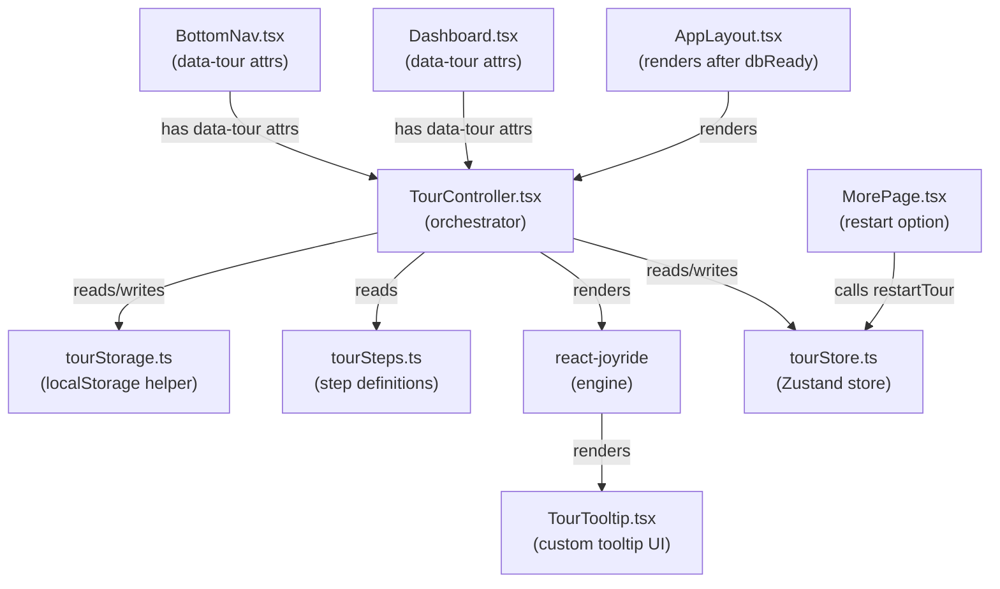
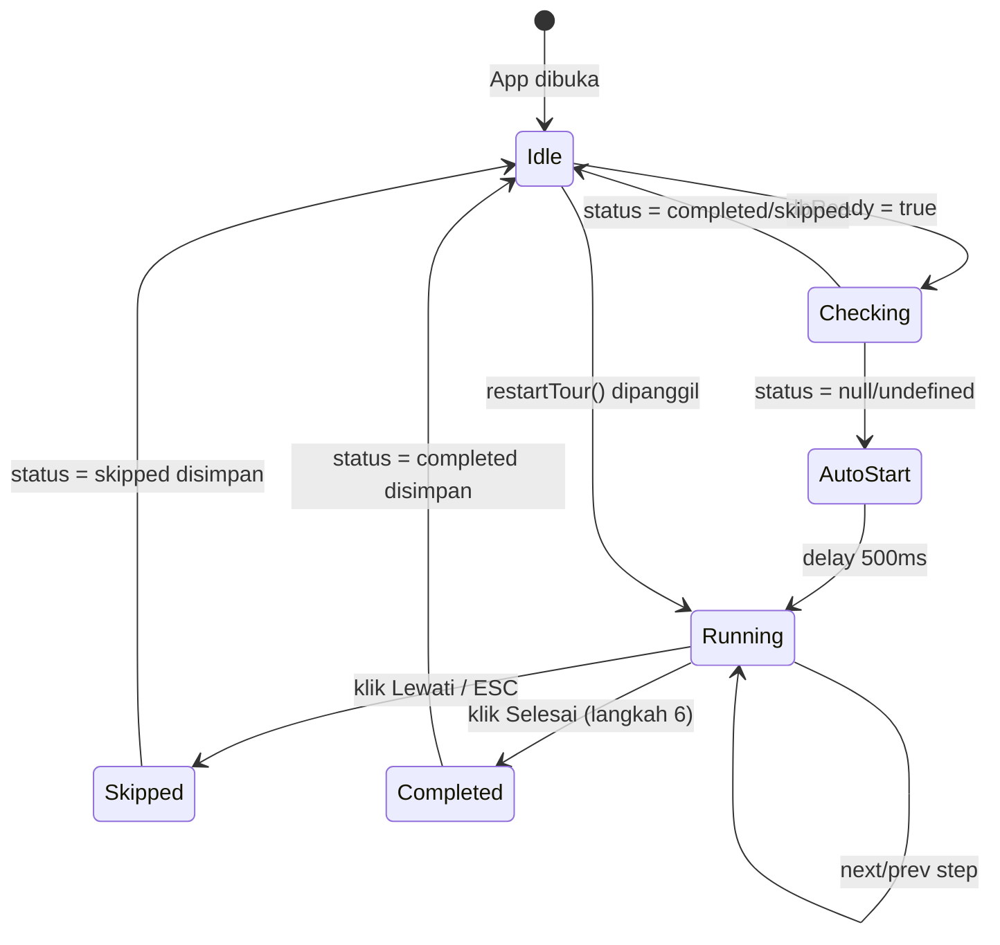

# Design Document: App Tour / Onboarding Tour

## Overview

Fitur **App Tour** adalah panduan interaktif langkah-demi-langkah yang memperkenalkan pengguna baru kepada fitur-fitur utama Flowang. Tour ditampilkan otomatis saat pertama kali pengguna membuka aplikasi (setelah DB siap), dan dapat dilewati atau diulang kapan saja melalui halaman "Lainnya".

Implementasi menggunakan library `react-joyride` yang sudah memenuhi standar WAI-ARIA, dikombinasikan dengan custom tooltip berbahasa Indonesia, Zustand store untuk state management, dan localStorage untuk persistensi status tour.

**Keputusan desain utama:**
- `react-joyride` dipilih karena sudah menyediakan focus trap, keyboard navigation, dan ARIA attributes secara built-in, sehingga mengurangi boilerplate aksesibilitas yang harus ditulis manual.
- State tour dipisahkan ke `tourStore.ts` (bukan digabung ke `uiStore.ts`) untuk menjaga separation of concerns dan memudahkan testing.
- Status tour disimpan di `localStorage` secara langsung (bukan via Zustand persist) karena status ini perlu dibaca sebelum store diinisialisasi.
- `TourController` dirender di dalam `AppLayout` setelah `dbReady === true`, sehingga tour hanya berjalan ketika aplikasi sudah siap sepenuhnya.


---

## Architecture

### Diagram Komponen



### Diagram Alur State Tour




---

## Components and Interfaces

### 1. `src/stores/tourStore.ts`

Zustand store yang mengelola state runtime tour. Tidak menggunakan `persist` middleware karena status permanen disimpan di `tourStorage.ts`.

```typescript
import { create } from 'zustand';

export type TourStatus = 'completed' | 'skipped' | 'in_progress' | null;

interface TourState {
  /** Apakah tour sedang berjalan (ditampilkan) */
  run: boolean;
  /** Indeks langkah saat ini (0-based) */
  stepIndex: number;
  /** Apakah tour sudah pernah auto-start di sesi ini */
  hasAutoStarted: boolean;
}

interface TourActions {
  startTour: () => void;
  stopTour: () => void;
  setStepIndex: (index: number) => void;
  restartTour: () => void;
  completeTour: () => void;
  skipTour: () => void;
  markAutoStarted: () => void;
}

export const useTourStore = create<TourState & TourActions>((set, get) => ({
  run: false,
  stepIndex: 0,
  hasAutoStarted: false,

  startTour: () => {
    set({ run: true });
    tourStorage.setStatus('in_progress');
  },

  stopTour: () => set({ run: false }),
  // stepIndex TIDAK direset saat stop — untuk mendukung resume

  setStepIndex: (index) => set({ stepIndex: index }),

  restartTour: () => {
    const previousStatus = tourStorage.getStatus();
    tourStorage.clearStatus();
    set({ run: true, stepIndex: 0 });
    tourStorage.setStatus('in_progress');
    // Jika gagal start, pulihkan status sebelumnya
    if (!get().run) {
      if (previousStatus) tourStorage.setStatus(previousStatus);
    }
  },

  completeTour: () => {
    set({ run: false });
    tourStorage.setStatus('completed');
  },

  skipTour: () => {
    set({ run: false });
    // stepIndex TIDAK direset — untuk mendukung resume
    tourStorage.setStatus('skipped');
  },

  markAutoStarted: () => set({ hasAutoStarted: true }),
}));
```


### 2. `src/lib/tourStorage.ts`

Helper untuk membaca dan menulis status tour ke `localStorage`. Semua operasi dibungkus try-catch untuk menangani kasus `localStorage` tidak tersedia.

```typescript
export type TourStatus = 'completed' | 'skipped' | 'in_progress';

const TOUR_STATUS_KEY = 'flowang_tour_status';
const VALID_STATUSES: TourStatus[] = ['completed', 'skipped', 'in_progress'];

export const tourStorage = {
  getStatus(): TourStatus | null {
    try {
      const value = localStorage.getItem(TOUR_STATUS_KEY);
      if (value === null) return null;
      // Validasi: nilai harus salah satu dari nilai yang valid
      if (VALID_STATUSES.includes(value as TourStatus)) {
        return value as TourStatus;
      }
      // Nilai korup atau tidak valid — perlakukan sebagai tidak ada status
      return null;
    } catch {
      console.warn('[TourStorage] localStorage tidak tersedia');
      return null;
    }
  },

  setStatus(status: TourStatus): void {
    try {
      localStorage.setItem(TOUR_STATUS_KEY, status);
      // Verifikasi round-trip: pastikan nilai yang tersimpan sama dengan yang diminta
      const stored = localStorage.getItem(TOUR_STATUS_KEY);
      if (stored !== status) {
        console.error('[TourStorage] Verifikasi penyimpanan gagal');
      }
    } catch (error) {
      console.error('[TourStorage] Gagal menyimpan status tour:', error);
    }
  },

  clearStatus(): void {
    try {
      localStorage.removeItem(TOUR_STATUS_KEY);
    } catch (error) {
      console.error('[TourStorage] Gagal menghapus status tour:', error);
    }
  },

  shouldAutoStart(): boolean {
    const status = this.getStatus();
    return status === null;
  },
};
```


### 3. `src/lib/tourSteps.ts`

Definisi 6 langkah tour. Setiap langkah menggunakan `data-tour` attribute sebagai selector untuk menghindari coupling dengan class CSS atau struktur DOM internal.

```typescript
import type { Step } from 'react-joyride';

export interface TourStepMeta extends Step {
  /** Judul langkah untuk ditampilkan di TourTooltip */
  title: string;
}

export const TOUR_STEPS: TourStepMeta[] = [
  {
    target: 'body',
    placement: 'center',
    disableBeacon: true,
    title: 'Selamat Datang di Flowang!',
    content: 'Flowang membantu kamu mencatat keuangan pribadi dengan mudah dan cepat. Mari kenali fitur-fitur utamanya.',
  },
  {
    target: '[data-tour="dashboard-summary"]',
    placement: 'bottom',
    disableBeacon: true,
    title: 'Ringkasan Keuangan',
    content: 'Di sini kamu bisa melihat total saldo, daftar wallet, serta ringkasan pemasukan dan pengeluaran bulan ini.',
  },
  {
    target: '[data-tour="add-transaction-btn"]',
    placement: 'bottom',
    disableBeacon: true,
    title: 'Catat Transaksi Baru',
    content: 'Ketuk tombol ini untuk mencatat transaksi baru — bisa pemasukan, pengeluaran, atau transfer antar wallet.',
  },
  {
    target: '[data-tour="nav-transactions"]',
    placement: 'top',
    disableBeacon: true,
    title: 'Riwayat Transaksi',
    content: 'Lihat semua transaksi kamu di sini, lengkap dengan filter berdasarkan wallet, kategori, dan rentang tanggal.',
  },
  {
    target: '[data-tour="nav-reports"]',
    placement: 'top',
    disableBeacon: true,
    title: 'Laporan Keuangan',
    content: 'Pantau rekap keuangan kamu dengan tab Realtime, Bulanan, dan Custom untuk periode yang kamu pilih.',
  },
  {
    target: '[data-tour="nav-more"]',
    placement: 'top',
    disableBeacon: true,
    title: 'Wallet & Kategori',
    content: 'Kelola wallet dan kategori transaksi kamu melalui menu Lainnya untuk pengalaman pencatatan yang lebih terorganisir.',
  },
];

// Validasi: jumlah langkah harus tepat 6
if (TOUR_STEPS.length !== 6) {
  throw new Error(`[TourSteps] Jumlah langkah harus 6, ditemukan: ${TOUR_STEPS.length}`);
}
```


### 4. `src/components/tour/TourTooltip.tsx`

Custom tooltip component yang menggantikan tooltip default react-joyride. Menampilkan tombol navigasi berbahasa Indonesia, indikator progres, dan memenuhi semua persyaratan aksesibilitas.

```typescript
import type { TooltipRenderProps } from 'react-joyride';

interface TourTooltipProps extends TooltipRenderProps {
  // TooltipRenderProps sudah mencakup: step, index, size, isLastStep,
  // backProps, closeProps, primaryProps, skipProps, tooltipProps
}

export function TourTooltip({
  step,
  index,
  size,
  isLastStep,
  backProps,
  primaryProps,
  skipProps,
  tooltipProps,
}: TourTooltipProps) {
  const stepNumber = index + 1;
  const announcementText = `Langkah ${stepNumber} dari ${size}: ${step.title}`;

  return (
    <div
      {...tooltipProps}
      role="dialog"
      aria-modal="true"
      aria-labelledby={`tour-title-${index}`}
      aria-describedby={`tour-content-${index}`}
      className="tour-tooltip rounded-2xl bg-background border border-border shadow-xl p-5 max-w-[min(90vw,360px)] min-w-[280px]"
    >
      {/* Screen reader announcement */}
      <span
        aria-live="polite"
        aria-atomic="true"
        className="sr-only"
      >
        {announcementText}
      </span>

      {/* Header: progres + skip */}
      <div className="flex items-center justify-between mb-3">
        <span className="text-xs text-muted-foreground font-medium">
          Langkah {stepNumber} dari {size}
        </span>
        <button
          {...skipProps}
          className="text-xs text-muted-foreground hover:text-foreground transition-colors min-h-[44px] min-w-[44px] flex items-center justify-center rounded-lg hover:bg-muted/50"
          aria-label="Lewati tour"
        >
          Lewati
        </button>
      </div>

      {/* Konten */}
      {step.title && (
        <h2
          id={`tour-title-${index}`}
          className="text-base font-semibold text-foreground mb-2 leading-snug"
        >
          {step.title as string}
        </h2>
      )}
      <p
        id={`tour-content-${index}`}
        className="text-sm text-muted-foreground leading-relaxed"
      >
        {step.content as string}
      </p>

      {/* Navigasi */}
      <div className="flex items-center justify-between mt-4 gap-2">
        <div className="flex-1">
          {index > 0 && (
            <button
              {...backProps}
              className="text-sm text-muted-foreground hover:text-foreground transition-colors min-h-[44px] min-w-[44px] px-3 rounded-xl hover:bg-muted/50"
              aria-label="Kembali ke langkah sebelumnya"
            >
              ← Kembali
            </button>
          )}
        </div>
        <button
          {...primaryProps}
          className="text-sm font-semibold bg-primary text-primary-foreground rounded-xl px-4 min-h-[44px] min-w-[44px] hover:bg-primary/90 active:scale-95 transition-all"
          aria-label={isLastStep ? 'Selesai dan tutup tour' : 'Lanjut ke langkah berikutnya'}
        >
          {isLastStep ? 'Selesai' : 'Lanjut →'}
        </button>
      </div>
    </div>
  );
}
```


### 5. `src/components/tour/TourController.tsx`

Komponen utama yang mengorkestrasikan seluruh logika tour. Dirender di `AppLayout` setelah `dbReady === true`.

```typescript
import { useEffect, useCallback, useRef } from 'react';
import Joyride, { type CallBackProps, STATUS, ACTIONS, EVENTS } from 'react-joyride';
import { useTourStore } from '@/stores/tourStore';
import { tourStorage } from '@/lib/tourStorage';
import { TOUR_STEPS } from '@/lib/tourSteps';
import { TourTooltip } from './TourTooltip';

const TOUR_STEP_COUNT = 6;
const AUTO_START_DELAY_MS = 500;

export function TourController() {
  const { run, stepIndex, hasAutoStarted, startTour, stopTour,
          setStepIndex, completeTour, skipTour, markAutoStarted } = useTourStore();

  // Simpan referensi elemen yang difokus sebelum tour dimulai
  const previousFocusRef = useRef<HTMLElement | null>(null);

  // Deteksi prefers-reduced-motion
  const prefersReducedMotion =
    typeof window !== 'undefined' &&
    window.matchMedia('(prefers-reduced-motion: reduce)').matches;

  // Auto-start saat pertama kali mount (setelah dbReady)
  useEffect(() => {
    if (hasAutoStarted) return;
    if (!tourStorage.shouldAutoStart()) return;
    if (TOUR_STEPS.length !== TOUR_STEP_COUNT) return;

    const timer = setTimeout(() => {
      previousFocusRef.current = document.activeElement as HTMLElement;
      markAutoStarted();
      startTour();
    }, AUTO_START_DELAY_MS);

    return () => clearTimeout(timer);
  }, [hasAutoStarted, startTour, markAutoStarted]);

  // Kembalikan fokus saat tour ditutup
  useEffect(() => {
    if (!run && previousFocusRef.current) {
      previousFocusRef.current.focus();
      previousFocusRef.current = null;
    }
  }, [run]);

  const handleCallback = useCallback((data: CallBackProps) => {
    const { status, action, index, type } = data;

    if (type === EVENTS.STEP_AFTER || type === EVENTS.TARGET_NOT_FOUND) {
      if (action === ACTIONS.NEXT) {
        setStepIndex(index + 1);
      } else if (action === ACTIONS.PREV) {
        setStepIndex(index - 1);
      }
    }

    if (status === STATUS.FINISHED) {
      completeTour();
    } else if (status === STATUS.SKIPPED || action === ACTIONS.CLOSE) {
      skipTour();
    }
  }, [setStepIndex, completeTour, skipTour]);

  const joyrideStyles = {
    options: {
      zIndex: 10100, // > bottom nav z-50 (50) dengan selisih > 100
      overlayColor: prefersReducedMotion
        ? 'rgba(0, 0, 0, 0.5)'
        : 'rgba(0, 0, 0, 0.5)',
      arrowColor: 'hsl(var(--background))',
    },
    spotlight: {
      borderRadius: '12px',
    },
    overlay: {
      mixBlendMode: 'normal' as const,
    },
  };

  return (
    <Joyride
      steps={TOUR_STEPS}
      run={run}
      stepIndex={stepIndex}
      continuous
      showSkipButton={false}  // Skip dihandle di TourTooltip custom
      disableOverlayClose
      disableScrolling={false}
      spotlightClicks={false}
      callback={handleCallback}
      tooltipComponent={TourTooltip}
      styles={joyrideStyles}
      floaterProps={{
        disableAnimation: prefersReducedMotion,
        styles: {
          floater: {
            filter: 'none',
          },
        },
      }}
      locale={{
        back: 'Kembali',
        close: 'Tutup',
        last: 'Selesai',
        next: 'Lanjut',
        skip: 'Lewati',
      }}
    />
  );
}
```


### 6. Modifikasi File yang Ada

#### `src/layouts/AppLayout.tsx`

Tambahkan `<TourController />` setelah kondisi `dbReady` terpenuhi:

```typescript
import { TourController } from '@/components/tour/TourController';

export default function AppLayout() {
  // ... kode yang ada ...

  return (
    <div className="mx-auto flex min-h-screen max-w-[480px] flex-col bg-background">
      <TourController />  {/* ← tambahkan di sini */}
      <main className="flex-1 overflow-y-auto pb-24">
        <Outlet />
      </main>
      <BottomNav />
    </div>
  );
}
```

#### `src/pages/Dashboard.tsx`

Tambahkan `data-tour` attributes ke elemen target:

```typescript
// Tombol "Catat" di header
<button
  type="button"
  data-tour="add-transaction-btn"  // ← tambahkan
  onClick={() => navigate("/transactions/new")}
  // ...
>

// SummaryCard
<SummaryCard
  data-tour="dashboard-summary"  // ← tambahkan sebagai prop atau wrapper div
  isHidden={isHidden}
  onHiddenChange={setIsHidden}
/>
```

> **Catatan:** Jika `SummaryCard` tidak meneruskan props tambahan ke root element-nya, bungkus dengan `<div data-tour="dashboard-summary">`.

#### `src/components/layout/BottomNav.tsx`

Tambahkan `data-tour` attributes ke NavLink dan tombol "Lainnya":

```typescript
// NavLink Transaksi
<NavLink to="/transactions" data-tour="nav-transactions" ...>

// NavLink Laporan
<NavLink to="/reports" data-tour="nav-reports" ...>

// Tombol Lainnya
<button data-tour="nav-more" onClick={() => navigate("/more")} ...>
```

#### `src/pages/more/MorePage.tsx`

Tambahkan opsi "Mulai Ulang Tour" di bagian bawah daftar navigasi:

```typescript
import { useTourStore } from '@/stores/tourStore';
import { tourStorage } from '@/lib/tourStorage';
import { MapPin } from 'lucide-react';

export default function MorePage() {
  const restartTour = useTourStore((s) => s.restartTour);
  const tourStatus = tourStorage.getStatus();
  const showRestartOption = tourStatus === 'skipped' || tourStatus === 'in_progress';

  return (
    <div className="px-4 py-6 space-y-6">
      {/* ... daftar navigasi yang ada ... */}

      {showRestartOption && (
        <div className="rounded-xl border bg-card overflow-hidden">
          <button
            onClick={restartTour}
            className="flex w-full items-center gap-3 px-4 py-3.5 text-left transition-colors hover:bg-muted/50 active:bg-muted"
          >
            <div className="flex h-8 w-8 shrink-0 items-center justify-center rounded-lg bg-primary/10">
              <MapPin className="h-4 w-4 text-primary" />
            </div>
            <span className="flex-1 min-w-0">
              <span className="text-sm font-medium">Mulai Ulang Tour</span>
              <span className="block text-xs text-muted-foreground">Ulangi panduan fitur dari awal</span>
            </span>
          </button>
        </div>
      )}
    </div>
  );
}
```


---

## Data Models

### TypeScript Types

```typescript
// src/lib/tourStorage.ts
export type TourStatus = 'completed' | 'skipped' | 'in_progress';

// src/stores/tourStore.ts
interface TourState {
  run: boolean;           // Apakah Joyride sedang aktif
  stepIndex: number;      // Indeks langkah saat ini (0-based, 0-5)
  hasAutoStarted: boolean; // Flag per-sesi untuk mencegah auto-start ganda
}

interface TourActions {
  startTour: () => void;
  stopTour: () => void;
  setStepIndex: (index: number) => void;
  restartTour: () => void;
  completeTour: () => void;
  skipTour: () => void;
  markAutoStarted: () => void;
}

// src/lib/tourSteps.ts
interface TourStepMeta extends Step {  // Step dari react-joyride
  title: string;
  content: string;
  target: string;
  placement?: 'top' | 'bottom' | 'left' | 'right' | 'center';
  disableBeacon?: boolean;
}
```

### localStorage Schema

| Kunci | Tipe | Nilai Valid | Keterangan |
|---|---|---|---|
| `flowang_tour_status` | `string` | `completed`, `skipped`, `in_progress` | Status penyelesaian tour |

Nilai selain yang terdaftar di atas dianggap korup dan diperlakukan sebagai `null` (tidak ada status).


---

## Correctness Properties

*A property is a characteristic or behavior that should hold true across all valid executions of a system — essentially, a formal statement about what the system should do. Properties serve as the bridge between human-readable specifications and machine-verifiable correctness guarantees.*

**Catatan:** Fitur ini mengandung logika bisnis murni yang cocok untuk property-based testing, terutama pada lapisan `tourStorage` (validasi, round-trip), `tourSteps` (invariant konfigurasi), dan `tourStore` (state transitions). Library yang digunakan adalah `fast-check` yang sudah tersedia di `devDependencies` proyek ini.

**Property Reflection:** Setelah analisis prework, beberapa criteria yang redundan telah dikonsolidasi:
- Req 1.3 dan 4.5 digabung ke dalam Property 1 (sudah tercakup oleh generator yang menghasilkan semua nilai status)
- Req 4.1 dan 4.2 digabung ke dalam Property 5 dan 6 (identik dengan Req 3.7 dan 3.8)
- Req 3.1, 3.2, 3.4, 3.5 dikonsolidasi menjadi satu Property 4 tentang tombol navigasi

### Property 1: Auto-start hanya terjadi ketika tidak ada status tour

*Untuk setiap* nilai yang mungkin ada di `localStorage` untuk kunci `flowang_tour_status` (termasuk null, string valid, dan string tidak valid), fungsi `shouldAutoStart()` harus mengembalikan `true` jika dan hanya jika nilai tersebut adalah `null` atau tidak ada.

**Validates: Requirements 1.1, 1.3, 4.5**

### Property 2: Validasi status tour menolak nilai tidak valid

*Untuk setiap* string acak yang bukan salah satu dari `'completed'`, `'skipped'`, atau `'in_progress'`, fungsi `getStatus()` harus mengembalikan `null` (bukan nilai string tersebut).

**Validates: Requirements 4.4**

### Property 3: Round-trip penyimpanan dan pembacaan status tour

*Untuk setiap* nilai status yang valid (`'completed'`, `'skipped'`, `'in_progress'`), menyimpan nilai tersebut dengan `setStatus()` lalu membacanya kembali dengan `getStatus()` harus menghasilkan nilai yang identik dengan nilai yang disimpan.

**Validates: Requirements 4.3**

### Property 4: Tombol navigasi sesuai dengan posisi langkah

*Untuk setiap* indeks langkah yang valid (0 hingga 5), komponen `TourTooltip` yang dirender harus memenuhi semua kondisi berikut secara bersamaan:
- Tombol "Lewati" selalu ada di setiap langkah
- Tombol "Kembali" ada jika dan hanya jika `stepIndex > 0`
- Tombol "Lanjut" ada jika dan hanya jika `stepIndex < 5`
- Tombol "Selesai" ada jika dan hanya jika `stepIndex === 5`
- Teks indikator progres menampilkan "Langkah {stepIndex+1} dari 6"

**Validates: Requirements 3.1, 3.2, 3.3, 3.4, 3.5, 3.6**

### Property 5: Skip tour menyimpan status skipped

*Untuk setiap* kondisi awal `tourStore` yang valid (run=true, stepIndex antara 0-5), memanggil `skipTour()` harus menghasilkan: `run === false`, `stepIndex` tidak berubah dari nilai sebelumnya, dan `tourStorage.getStatus() === 'skipped'`.

**Validates: Requirements 3.7, 4.2**

### Property 6: Complete tour menyimpan status completed

*Untuk setiap* kondisi awal `tourStore` yang valid (run=true, stepIndex=5), memanggil `completeTour()` harus menghasilkan: `run === false` dan `tourStorage.getStatus() === 'completed'`.

**Validates: Requirements 3.8, 4.1**

### Property 7: Skip mempertahankan stepIndex untuk resume

*Untuk setiap* nilai `stepIndex` yang valid (0 hingga 5), memanggil `skipTour()` tidak boleh mengubah nilai `stepIndex` di state — nilai harus tetap sama sebelum dan sesudah skip.

**Validates: Requirements 5.1**

### Property 8: Konfigurasi langkah tour memenuhi invariant konten

*Untuk setiap* langkah dalam `TOUR_STEPS`, langkah tersebut harus memiliki: `title` dengan panjang tidak lebih dari 15 kata, `content` yang tidak mengandung lebih dari 2 kalimat, `target` yang merupakan string non-kosong, dan `disableBeacon === true`.

**Validates: Requirements 1.4, 2.7**

### Property 9: z-index overlay selalu lebih tinggi dari bottom nav

*Untuk setiap* konfigurasi `joyrideStyles` yang dihasilkan oleh `TourController`, nilai `options.zIndex` harus selalu lebih besar dari atau sama dengan 10000, dan harus lebih besar dari z-index bottom navigation bar (z-50 = 50) dengan selisih minimal 100.

**Validates: Requirements 8.5**

### Property 10: Teks aria-live mengikuti format yang benar untuk setiap langkah

*Untuk setiap* indeks langkah yang valid (0 hingga 5), teks yang dihasilkan untuk elemen `aria-live` harus mengikuti format `"Langkah {n} dari 6: {title}"` di mana `n = stepIndex + 1` dan `title` adalah judul langkah yang sesuai.

**Validates: Requirements 6.8**

### Property 11: Auto-start tidak terjadi lebih dari sekali per sesi

*Untuk setiap* urutan pemanggilan `startTour()` yang berulang dalam satu sesi (dengan `hasAutoStarted === true`), tour tidak boleh dimulai secara otomatis lebih dari satu kali — flag `hasAutoStarted` harus mencegah eksekusi ulang.

**Validates: Requirements 7.5**


---

## Error Handling

### Skenario Error dan Penanganannya

| Skenario | Perilaku yang Diharapkan |
|---|---|
| `localStorage` tidak tersedia | `tourStorage.getStatus()` mengembalikan `null`, tour tidak ditampilkan, pesan warning dicatat ke konsol |
| `localStorage` penuh saat `setStatus()` | Error dicatat ke konsol, tour tetap berjalan tanpa menyimpan status |
| Nilai korup di `localStorage` | `getStatus()` mengembalikan `null`, diperlakukan sebagai tidak ada status |
| Elemen target tidak ditemukan di DOM | `react-joyride` menangani via `TARGET_NOT_FOUND` event, langkah dilewati otomatis |
| `TOUR_STEPS.length !== 6` | Error dilempar saat module load, tour tidak berjalan |
| `restartTour()` gagal memulai tour | Status sebelumnya dipulihkan ke `localStorage` |

### Error Boundary

`TourController` tidak perlu dibungkus dengan Error Boundary khusus karena:
1. Semua operasi `localStorage` sudah dibungkus try-catch
2. `react-joyride` menangani elemen target yang tidak ditemukan secara internal
3. Kegagalan tour tidak boleh memblokir penggunaan aplikasi utama

Jika `TourController` melempar error yang tidak tertangkap, error akan naik ke Error Boundary terdekat di atas `AppLayout` (jika ada), atau menyebabkan halaman blank — yang dapat diterima karena tour adalah fitur opsional.


---

## Testing Strategy

### Pendekatan Dual Testing

Fitur ini menggunakan dua lapisan testing yang saling melengkapi:

1. **Property-based tests** — memverifikasi properti universal yang harus berlaku untuk semua input valid, menggunakan `fast-check` (sudah ada di `devDependencies`)
2. **Unit tests (example-based)** — memverifikasi perilaku spesifik dengan contoh konkret, menggunakan `@testing-library/react` dan `@testing-library/user-event`

### Konfigurasi Property-Based Testing

```typescript
// Setiap property test dikonfigurasi dengan minimal 100 iterasi
import fc from 'fast-check';

fc.assert(
  fc.property(/* ... */),
  { numRuns: 100 }
);
```

Tag format untuk setiap property test:
```
// Feature: app-tour, Property {N}: {deskripsi singkat property}
```

### Rencana Test per File

#### `src/lib/tourStorage.test.ts` — Property Tests

```typescript
// Feature: app-tour, Property 1: shouldAutoStart hanya true ketika tidak ada status
test('shouldAutoStart hanya mengembalikan true untuk status null', () => {
  fc.assert(
    fc.property(
      fc.oneof(
        fc.constant(null),
        fc.constant('completed'),
        fc.constant('skipped'),
        fc.constant('in_progress'),
        fc.string()  // nilai acak/korup
      ),
      (statusValue) => {
        // Setup localStorage dengan nilai yang digenerate
        if (statusValue === null) {
          localStorage.removeItem('flowang_tour_status');
        } else {
          localStorage.setItem('flowang_tour_status', statusValue);
        }
        const result = tourStorage.shouldAutoStart();
        const expected = statusValue === null;
        return result === expected;
      }
    ),
    { numRuns: 100 }
  );
});

// Feature: app-tour, Property 2: validasi menolak nilai tidak valid
test('getStatus mengembalikan null untuk nilai tidak valid', () => {
  const validStatuses = ['completed', 'skipped', 'in_progress'];
  fc.assert(
    fc.property(
      fc.string().filter(s => !validStatuses.includes(s) && s.length > 0),
      (invalidValue) => {
        localStorage.setItem('flowang_tour_status', invalidValue);
        return tourStorage.getStatus() === null;
      }
    ),
    { numRuns: 100 }
  );
});

// Feature: app-tour, Property 3: round-trip penyimpanan dan pembacaan
test('setStatus lalu getStatus mengembalikan nilai yang sama', () => {
  const validStatuses: TourStatus[] = ['completed', 'skipped', 'in_progress'];
  fc.assert(
    fc.property(
      fc.constantFrom(...validStatuses),
      (status) => {
        tourStorage.setStatus(status);
        return tourStorage.getStatus() === status;
      }
    ),
    { numRuns: 100 }
  );
});
```

#### `src/lib/tourSteps.test.ts` — Property Tests

```typescript
// Feature: app-tour, Property 8: invariant konten setiap langkah
test('setiap langkah memenuhi constraint konten', () => {
  TOUR_STEPS.forEach((step, index) => {
    const wordCount = (step.title as string).split(/\s+/).length;
    expect(wordCount).toBeLessThanOrEqual(15);

    const sentences = (step.content as string)
      .split(/[.!?]+/)
      .filter(s => s.trim().length > 0);
    expect(sentences.length).toBeLessThanOrEqual(2);

    expect(step.target).toBeTruthy();
    expect(step.disableBeacon).toBe(true);
  });
});

// Invariant: jumlah langkah harus tepat 6
test('TOUR_STEPS memiliki tepat 6 langkah', () => {
  expect(TOUR_STEPS.length).toBe(6);
});
```

#### `src/components/tour/TourTooltip.test.tsx` — Property Tests

```typescript
// Feature: app-tour, Property 4: tombol navigasi sesuai posisi langkah
test('tombol navigasi sesuai untuk setiap stepIndex', () => {
  fc.assert(
    fc.property(
      fc.integer({ min: 0, max: 5 }),
      (stepIndex) => {
        const { getByText, queryByText } = render(
          <TourTooltip
            step={TOUR_STEPS[stepIndex]}
            index={stepIndex}
            size={6}
            isLastStep={stepIndex === 5}
            // ... mock props lainnya
          />
        );

        // Lewati selalu ada
        expect(getByText('Lewati')).toBeInTheDocument();

        // Kembali ada jika bukan langkah pertama
        if (stepIndex > 0) {
          expect(getByText(/Kembali/)).toBeInTheDocument();
        } else {
          expect(queryByText(/Kembali/)).not.toBeInTheDocument();
        }

        // Lanjut vs Selesai
        if (stepIndex === 5) {
          expect(getByText('Selesai')).toBeInTheDocument();
          expect(queryByText(/Lanjut/)).not.toBeInTheDocument();
        } else {
          expect(getByText(/Lanjut/)).toBeInTheDocument();
          expect(queryByText('Selesai')).not.toBeInTheDocument();
        }

        // Teks progres
        expect(getByText(`Langkah ${stepIndex + 1} dari 6`)).toBeInTheDocument();
      }
    ),
    { numRuns: 6 }  // Hanya 6 nilai valid, jalankan semua
  );
});

// Feature: app-tour, Property 10: format teks aria-live
test('teks aria-live mengikuti format yang benar', () => {
  fc.assert(
    fc.property(
      fc.integer({ min: 0, max: 5 }),
      (stepIndex) => {
        const step = TOUR_STEPS[stepIndex];
        const { container } = render(
          <TourTooltip index={stepIndex} step={step} size={6} isLastStep={stepIndex === 5} /* ... */ />
        );
        const liveRegion = container.querySelector('[aria-live="polite"]');
        const expectedText = `Langkah ${stepIndex + 1} dari 6: ${step.title}`;
        return liveRegion?.textContent?.includes(expectedText) ?? false;
      }
    ),
    { numRuns: 6 }
  );
});
```

#### `src/stores/tourStore.test.ts` — Property Tests

```typescript
// Feature: app-tour, Property 5: skip menyimpan status skipped
test('skipTour menyimpan status skipped dan tidak mengubah stepIndex', () => {
  fc.assert(
    fc.property(
      fc.integer({ min: 0, max: 5 }),
      (initialStepIndex) => {
        const store = createTourStore();
        store.setState({ run: true, stepIndex: initialStepIndex });
        store.getState().skipTour();

        expect(store.getState().run).toBe(false);
        expect(store.getState().stepIndex).toBe(initialStepIndex);
        expect(tourStorage.getStatus()).toBe('skipped');
      }
    ),
    { numRuns: 100 }
  );
});

// Feature: app-tour, Property 7: skip mempertahankan stepIndex
test('skipTour tidak mengubah stepIndex', () => {
  fc.assert(
    fc.property(
      fc.integer({ min: 0, max: 5 }),
      (stepIndex) => {
        const store = createTourStore();
        store.setState({ stepIndex });
        const beforeSkip = store.getState().stepIndex;
        store.getState().skipTour();
        return store.getState().stepIndex === beforeSkip;
      }
    ),
    { numRuns: 100 }
  );
});
```

### Unit Tests (Example-Based)

```typescript
// TourController.test.tsx
describe('TourController', () => {
  it('auto-start setelah 500ms ketika tidak ada status tour', async () => {
    jest.useFakeTimers();
    localStorage.removeItem('flowang_tour_status');
    render(<TourController />);
    expect(useTourStore.getState().run).toBe(false);
    jest.advanceTimersByTime(500);
    expect(useTourStore.getState().run).toBe(true);
  });

  it('tidak auto-start ketika status adalah completed', () => {
    localStorage.setItem('flowang_tour_status', 'completed');
    render(<TourController />);
    jest.advanceTimersByTime(1000);
    expect(useTourStore.getState().run).toBe(false);
  });

  it('mengembalikan fokus ke elemen sebelumnya saat tour ditutup', async () => {
    const button = document.createElement('button');
    document.body.appendChild(button);
    button.focus();
    // ... simulasi tour start dan stop
    expect(document.activeElement).toBe(button);
  });

  it('menonaktifkan animasi ketika prefers-reduced-motion aktif', () => {
    window.matchMedia = jest.fn().mockReturnValue({ matches: true });
    // ... verifikasi floaterProps.disableAnimation === true
  });
});
```

### Aksesibilitas Testing

Selain automated tests, lakukan manual testing dengan:
- **VoiceOver** (macOS/iOS) atau **NVDA** (Windows) untuk memverifikasi pengumuman screen reader
- **Keyboard-only navigation** untuk memverifikasi focus trap dan urutan Tab
- **Zoom 200%** untuk memverifikasi tooltip tidak terpotong di viewport


---

## Pertimbangan Aksesibilitas

### Focus Management

`react-joyride` secara built-in menangani focus trap di dalam tooltip. Implementasi tambahan yang diperlukan:

1. **Simpan referensi fokus sebelum tour** — `previousFocusRef.current = document.activeElement` sebelum `startTour()` dipanggil
2. **Kembalikan fokus saat tour ditutup** — `previousFocusRef.current?.focus()` di `useEffect` yang memantau `run === false`
3. **Auto-focus ke tombol pertama** — `react-joyride` menangani ini secara otomatis saat tooltip muncul

### ARIA Attributes

`TourTooltip` harus memiliki atribut berikut pada root element:
```html
<div
  role="dialog"
  aria-modal="true"
  aria-labelledby="tour-title-{index}"
  aria-describedby="tour-content-{index}"
>
```

Elemen `aria-live` untuk pengumuman screen reader:
```html
<span aria-live="polite" aria-atomic="true" class="sr-only">
  Langkah {n} dari 6: {judul langkah}
</span>
```

### Keyboard Navigation

`react-joyride` menangani navigasi keyboard berikut secara built-in:
- **Tab / Shift+Tab** — berpindah antar tombol di dalam tooltip (focus trap)
- **ESC** — menutup tour (dikonfigurasi via `disableCloseOnEsc: false`)
- **Enter / Space** — mengaktifkan tombol yang sedang difokus

Navigasi arrow key (→ untuk next, ← untuk prev) perlu diimplementasikan secara manual di `TourController` via `keydown` event listener jika diperlukan.

### Reduced Motion

```typescript
const prefersReducedMotion = window.matchMedia('(prefers-reduced-motion: reduce)').matches;

// Di TourController:
floaterProps={{
  disableAnimation: prefersReducedMotion,
}}
```

Ketika `prefers-reduced-motion` aktif:
- Semua animasi transisi tooltip dinonaktifkan
- Spotlight tidak memiliki animasi pulse
- Overlay muncul secara instan

---

## Pertimbangan Mobile-First

### Ukuran dan Posisi Tooltip

```typescript
// Konfigurasi styles untuk mobile
const joyrideStyles = {
  tooltip: {
    width: 'min(90vw, 360px)',
    minWidth: '280px',
  },
  options: {
    zIndex: 10100,
  },
};
```

### Touch Targets

Semua tombol kontrol di `TourTooltip` menggunakan `min-h-[44px] min-w-[44px]` sesuai standar WCAG 2.5.5.

### Z-Index Hierarchy

| Elemen | Z-Index | Keterangan |
|---|---|---|
| Bottom Navigation | 50 (z-50) | Dari kode `BottomNav.tsx` |
| Tour Overlay | 10100 | Selisih > 100 dari bottom nav |
| Tour Tooltip | 10101 | Di atas overlay |

### Posisi Tooltip untuk Bottom Nav Steps

Langkah 4, 5, dan 6 menargetkan elemen di bottom navigation. Tooltip harus ditempatkan di atas elemen target (`placement: 'top'`) agar tidak tertutup oleh overlay atau terpotong di bawah layar.

`react-joyride` secara otomatis menyesuaikan posisi jika tooltip akan keluar dari viewport, namun konfigurasi `placement: 'top'` sebagai default untuk langkah-langkah bottom nav memastikan perilaku yang konsisten.


---

## Instalasi Dependensi

`react-joyride` belum ada di `package.json` dan perlu diinstall:

```bash
bun add react-joyride
bun add -d @types/react-joyride  # jika diperlukan (react-joyride sudah include types)
```

Versi yang direkomendasikan: `react-joyride@^2.9.x` (versi stabil terbaru yang kompatibel dengan React 19).

---

## Ringkasan File yang Dibuat/Dimodifikasi

| File | Aksi | Keterangan |
|---|---|---|
| `src/stores/tourStore.ts` | **Buat baru** | Zustand store untuk state tour |
| `src/lib/tourStorage.ts` | **Buat baru** | Helper localStorage untuk status tour |
| `src/lib/tourSteps.ts` | **Buat baru** | Definisi 6 langkah tour |
| `src/components/tour/TourController.tsx` | **Buat baru** | Komponen orkestrator tour |
| `src/components/tour/TourTooltip.tsx` | **Buat baru** | Custom tooltip berbahasa Indonesia |
| `src/layouts/AppLayout.tsx` | **Modifikasi** | Tambah `<TourController />` |
| `src/pages/Dashboard.tsx` | **Modifikasi** | Tambah `data-tour` attributes |
| `src/components/layout/BottomNav.tsx` | **Modifikasi** | Tambah `data-tour` attributes |
| `src/pages/more/MorePage.tsx` | **Modifikasi** | Tambah opsi "Mulai Ulang Tour" |
| `src/lib/tourStorage.test.ts` | **Buat baru** | Property tests untuk tourStorage |
| `src/lib/tourSteps.test.ts` | **Buat baru** | Tests untuk invariant tourSteps |
| `src/components/tour/TourTooltip.test.tsx` | **Buat baru** | Property tests untuk TourTooltip |
| `src/stores/tourStore.test.ts` | **Buat baru** | Property tests untuk tourStore |
