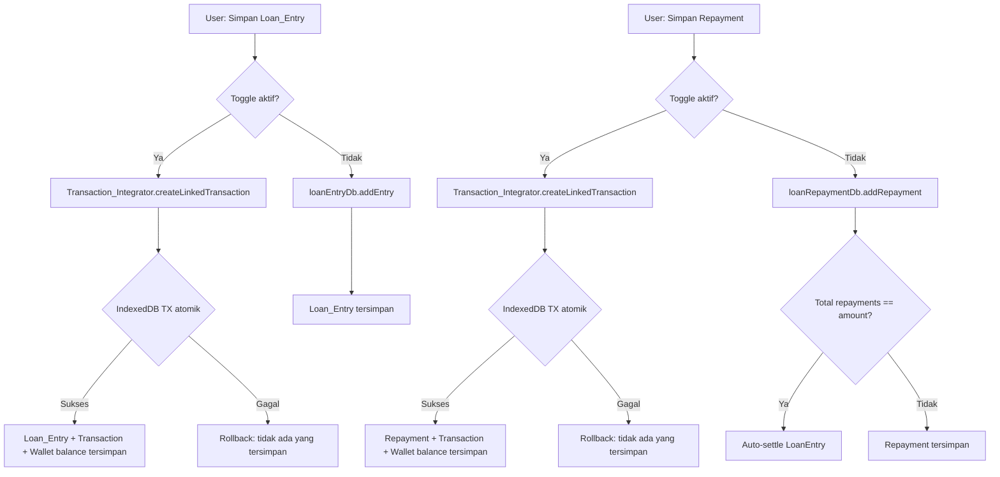

# Design Document

## Loan Repayment & Transaction Integration

---

## Overview

Fitur ini memperluas modul Loan Tracker yang sudah ada di Flowang dengan empat kapabilitas baru:

1. **Repayment** — pencatatan pembayaran parsial maupun pelunasan penuh atas Loan_Entry aktif
2. **Transaction Integration** — pembuatan Linked_Transaction secara opsional saat membuat Loan_Entry atau Repayment
3. **Loan Report Section** — ringkasan posisi hutang-piutang aktif di halaman laporan
4. **Kategori pada Loan** — klasifikasi Loan_Entry dan Repayment menggunakan sistem kategori yang sudah ada

Semua fitur ini tetap mempertahankan prinsip **offline-first**: seluruh data disimpan di IndexedDB tanpa memerlukan koneksi internet. Operasi yang melibatkan beberapa object store dieksekusi dalam satu IndexedDB transaction untuk menjamin atomicity.

### Konteks Arsitektur yang Ada

Flowang sudah memiliki:
- `transactions` object store dengan atomic wallet balance update via `addTransaction`, `updateTransaction`, `deleteTransaction`
- `loan_entries` object store dengan index `by_contactId`, `by_date`, `by_status`
- `wallets` dan `categories` object store
- Zustand stores untuk state management (`useTransactionStore`, `useLoanEntryStore`, dll.)
- Pola `requestToPromise` helper untuk wrapping IDBRequest

Fitur baru ini mengikuti pola yang sama dan memperluas skema database dari versi 2 ke versi 3.

---

## Architecture

### Komponen Baru

```
src/
├── db/
│   └── loanRepaymentDb.ts          # CRUD operations untuk loan_repayments
├── stores/
│   └── loanRepaymentStore.ts       # Zustand store untuk Repayment state
├── hooks/
│   └── useLoanRepayments.ts        # Hook untuk akses repayment store
├── lib/
│   └── transactionIntegrator.ts    # Logika Transaction_Integrator (pure functions)
├── components/
│   └── loans/
│       ├── RepaymentForm.tsx        # Form pencatatan Repayment
│       ├── RepaymentList.tsx        # Daftar Repayment dalam LoanDetail
│       └── LoanReportSection.tsx   # Ringkasan hutang-piutang di Reports
└── pages/
    └── reports/
        └── (modifikasi ReportsPage.tsx untuk menyertakan LoanReportSection)
```

### Komponen yang Dimodifikasi

| File | Perubahan |
|---|---|
| `src/db/db.ts` | Upgrade DB_VERSION ke 3, tambah object store `loan_repayments` |
| `src/types/index.ts` | Tambah tipe `Repayment`, `RepaymentFormData`, perbarui `LoanEntry` |
| `src/stores/loanEntryStore.ts` | Perbarui `addEntry` dan `deleteEntry` untuk mendukung Transaction_Integrator |
| `src/pages/loans/LoanDetailPage.tsx` | Tambah tombol "Catat Pembayaran" dan daftar Repayment |
| `src/pages/loans/NewLoanPage.tsx` | Tambah toggle "Catat sebagai transaksi", field Wallet, Kategori |
| `src/pages/loans/EditLoanPage.tsx` | Tambah field Kategori |
| `src/pages/reports/ReportsPage.tsx` | Tambah LoanReportSection di semua tab |

### Alur Data



---

## Components and Interfaces

### Transaction_Integrator (`src/lib/transactionIntegrator.ts`)

Modul pure-function yang bertanggung jawab menentukan tipe transaksi dan mengeksekusi operasi atomik.

```typescript
/**
 * Menentukan tipe Transaction yang harus dibuat berdasarkan konteks.
 * 
 * Untuk Loan_Entry:
 *   - direction 'borrow' → 'income' (uang masuk ke wallet)
 *   - direction 'lend'   → 'expense' (uang keluar dari wallet)
 * 
 * Untuk Repayment:
 *   - direction LoanEntry 'lend'   → 'income' (uang kembali masuk)
 *   - direction LoanEntry 'borrow' → 'expense' (uang keluar untuk bayar hutang)
 */
export function resolveTransactionType(
  context: 'loan_entry' | 'repayment',
  direction: LoanDirection
): 'income' | 'expense'

/**
 * Membuat Loan_Entry beserta Linked_Transaction secara atomik dalam satu IndexedDB transaction.
 * Jika salah satu gagal, seluruh operasi di-rollback.
 */
export async function createLoanEntryWithTransaction(
  db: IDBDatabase,
  entry: LoanEntry,
  transactionData: LinkedTransactionInput
): Promise<void>

/**
 * Menghapus Loan_Entry beserta Linked_Transaction dan semua Repayment terkait secara atomik.
 */
export async function deleteLoanEntryWithCascade(
  db: IDBDatabase,
  entryId: string
): Promise<void>

/**
 * Membuat Repayment beserta Linked_Transaction secara atomik.
 * Juga mengecek apakah LoanEntry perlu di-settle setelah repayment ini.
 */
export async function createRepaymentWithTransaction(
  db: IDBDatabase,
  repayment: Repayment,
  loanEntry: LoanEntry,
  transactionData?: LinkedTransactionInput
): Promise<{ autoSettled: boolean }>

/**
 * Menghapus Repayment beserta Linked_Transaction secara atomik.
 * Juga mengecek apakah LoanEntry perlu di-unsettled setelah penghapusan.
 */
export async function deleteRepaymentWithCascade(
  db: IDBDatabase,
  repaymentId: string,
  loanEntry: LoanEntry
): Promise<{ autoUnsettled: boolean }>
```

### loanRepaymentDb (`src/db/loanRepaymentDb.ts`)

```typescript
export async function getAllRepayments(db: IDBDatabase): Promise<Repayment[]>
export async function getRepaymentsByLoanEntryId(db: IDBDatabase, loanEntryId: string): Promise<Repayment[]>
export async function getRepaymentById(db: IDBDatabase, id: string): Promise<Repayment | undefined>
export async function addRepayment(db: IDBDatabase, repayment: Repayment): Promise<void>
export async function deleteRepayment(db: IDBDatabase, id: string): Promise<void>
export async function deleteRepaymentsByLoanEntryId(db: IDBDatabase, loanEntryId: string): Promise<void>
```

### loanRepaymentStore (`src/stores/loanRepaymentStore.ts`)

```typescript
interface LoanRepaymentState {
  repayments: Repayment[];
  isLoading: boolean;
  error: string | null;
}

interface LoanRepaymentActions {
  loadRepayments: () => Promise<void>;
  addRepayment: (data: RepaymentFormData, loanEntry: LoanEntry) => Promise<void>;
  deleteRepayment: (id: string, loanEntry: LoanEntry) => Promise<void>;
}
```

### RepaymentForm (`src/components/loans/RepaymentForm.tsx`)

Form dengan field:
- `amount` — number input, wajib, > 0, ≤ remainingAmount
- `date` — date input, wajib, default hari ini
- `note` — text input, opsional
- `categoryId` — select dari daftar Category, opsional
- Toggle "Catat sebagai transaksi" — default nonaktif
  - Jika aktif: `walletId` (wajib), `categoryId` (wajib)

### LoanReportSection (`src/components/loans/LoanReportSection.tsx`)

```typescript
interface LoanReportSectionProps {
  entries: LoanEntry[];
  repayments: Repayment[];
  onNavigateToContact: (contactId: string) => void;
}
```

Menampilkan:
- Total piutang aktif (sum remaining amount, direction = 'lend', status = 'active')
- Total hutang aktif (sum remaining amount, direction = 'borrow', status = 'active')
- Net posisi (piutang − hutang)
- Daftar item per contact yang dapat diklik untuk navigasi

---

## Data Models

### Tipe Baru: `Repayment`

```typescript
export interface Repayment {
  id: string;                    // UUID v4
  loanEntryId: string;           // FK → LoanEntry.id
  amount: number;                // > 0, maks 999_999_999_999
  categoryId?: string;           // FK → Category.id (opsional)
  linkedTransactionId?: string;  // FK → Transaction.id (opsional, null jika tidak ada)
  date: string;                  // YYYY-MM-DD
  note?: string;                 // opsional
  createdAt: string;             // ISO 8601
  updatedAt: string;             // ISO 8601
}

export interface RepaymentFormData {
  loanEntryId: string;
  amount: number;
  date: string;
  note?: string;
  categoryId?: string;
  // Transaction integration fields
  createTransaction: boolean;    // toggle "Catat sebagai transaksi"
  walletId?: string;             // wajib jika createTransaction = true
}
```

### Perluasan `LoanEntry`

```typescript
export interface LoanEntry {
  // ... field yang sudah ada ...
  id: string;
  contactId: string;
  amount: number;
  direction: LoanDirection;
  status: LoanStatus;
  date: string;
  note?: string;
  settledAt?: string;
  createdAt: string;
  updatedAt: string;
  // Field baru:
  categoryId?: string;           // FK → Category.id (opsional)
  linkedTransactionId?: string;  // FK → Transaction.id (opsional, null jika tidak ada)
  remainingAmount: number;       // dihitung: amount - sum(repayments.amount)
}
```

### Perluasan `LoanEntryFormData`

```typescript
export interface LoanEntryFormData {
  // ... field yang sudah ada ...
  contactId: string;
  amount: number;
  direction: LoanDirection;
  date: string;
  note?: string;
  // Field baru:
  categoryId?: string;
  // Transaction integration fields
  createTransaction: boolean;    // toggle "Catat sebagai transaksi"
  walletId?: string;             // wajib jika createTransaction = true
}
```

### Tipe Bantu

```typescript
export interface LinkedTransactionInput {
  walletId: string;
  categoryId?: string;
  date: string;
  amount: number;
  note?: string;
}
```

### Skema IndexedDB (DB_VERSION 3)

Object store baru: `loan_repayments`

| Field | Tipe | Keterangan |
|---|---|---|
| `id` | string (UUID) | keyPath |
| `loanEntryId` | string | FK → loan_entries.id, diindex |
| `amount` | number | > 0 |
| `categoryId` | string? | FK → categories.id, opsional |
| `linkedTransactionId` | string? | FK → transactions.id, opsional |
| `date` | string | YYYY-MM-DD |
| `note` | string? | opsional |
| `createdAt` | string | ISO 8601 |
| `updatedAt` | string | ISO 8601 |

Index: `by_loanEntryId` pada field `loanEntryId`

Upgrade dari versi 2 ke 3 juga menambahkan field `categoryId`, `linkedTransactionId`, dan `remainingAmount` pada record `loan_entries` yang sudah ada (nilai default: `undefined`/`null` untuk field opsional, `amount` untuk `remainingAmount`).

---

## Correctness Properties

*A property is a characteristic or behavior that should hold true across all valid executions of a system — essentially, a formal statement about what the system should do. Properties serve as the bridge between human-readable specifications and machine-verifiable correctness guarantees.*

Proyek ini menggunakan **fast-check** (sudah terdaftar di `devDependencies`) sebagai library property-based testing, dikombinasikan dengan **fake-indexeddb** untuk mensimulasikan IndexedDB secara in-memory.

### Property 1: Validasi amount Repayment — angka non-positif selalu ditolak

*For any* angka yang kurang dari atau sama dengan nol, validasi Repayment SHALL menolak nilai tersebut dan tidak menyimpan data apapun ke database.

**Validates: Requirements 1.3**

---

### Property 2: Validasi amount Repayment — melebihi remaining amount selalu ditolak

*For any* LoanEntry dengan amount acak dan sekumpulan Repayment parsial yang valid, jika Repayment baru diajukan dengan amount yang melebihi remaining amount, maka validasi SHALL menolak Repayment tersebut.

**Validates: Requirements 1.4**

---

### Property 3: Repayment round-trip — data tersimpan dan dapat dibaca kembali

*For any* Repayment yang valid (amount > 0, amount ≤ remainingAmount), setelah disimpan ke IndexedDB, membaca kembali Repayment tersebut berdasarkan id SHALL menghasilkan data yang identik dengan data yang disimpan.

**Validates: Requirements 1.5**

---

### Property 4: Auto-settle — total repayment sama dengan amount mengubah status ke settled

*For any* LoanEntry dengan amount acak, jika sekumpulan Repayment ditambahkan sehingga total amount-nya tepat sama dengan amount LoanEntry, maka status LoanEntry SHALL secara otomatis berubah menjadi `settled`.

**Validates: Requirements 1.6**

---

### Property 5: Auto-unsettle — menghapus Repayment dari LoanEntry settled mengembalikan status ke active

*For any* LoanEntry yang berstatus `settled` (karena total repayment == amount), jika satu Repayment dihapus sehingga total repayment < amount, maka status LoanEntry SHALL kembali menjadi `active`.

**Validates: Requirements 1.8**

---

### Property 6: Tipe Linked_Transaction untuk Loan_Entry sesuai direction

*For any* LoanEntry dengan direction acak (`lend` atau `borrow`), jika dibuat dengan toggle "Catat sebagai transaksi" aktif, maka tipe Linked_Transaction yang dibuat SHALL sesuai aturan: `borrow` → `income`, `lend` → `expense`.

**Validates: Requirements 2.3**

---

### Property 7: Saldo wallet berubah sesuai tipe transaksi setelah pembuatan Loan_Entry

*For any* Wallet dengan saldo awal acak dan LoanEntry dengan amount acak, setelah Linked_Transaction dibuat, saldo Wallet SHALL berubah sebesar amount dengan arah yang sesuai tipe transaksi (income: +amount, expense: -amount).

**Validates: Requirements 2.4**

---

### Property 8: linkedTransactionId tersimpan pada Loan_Entry

*For any* LoanEntry yang dibuat dengan toggle aktif dan Wallet dipilih, field `linkedTransactionId` pada LoanEntry yang tersimpan SHALL berisi id dari Linked_Transaction yang dibuat, dan Transaction dengan id tersebut SHALL ada di object store `transactions`.

**Validates: Requirements 2.6**

---

### Property 9: Saldo wallet kembali ke nilai awal setelah Loan_Entry dengan Linked_Transaction dihapus

*For any* Wallet dengan saldo awal acak, setelah LoanEntry dengan Linked_Transaction dibuat lalu dihapus, saldo Wallet SHALL kembali ke nilai sebelum LoanEntry dibuat.

**Validates: Requirements 2.7**

---

### Property 10: Tipe Linked_Transaction untuk Repayment sesuai direction LoanEntry

*For any* LoanEntry dengan direction acak dan Repayment yang dibuat dengan toggle aktif, tipe Linked_Transaction SHALL sesuai aturan: direction `lend` → `income`, direction `borrow` → `expense`.

**Validates: Requirements 3.3**

---

### Property 11: linkedTransactionId tersimpan pada Repayment

*For any* Repayment yang dibuat dengan toggle aktif dan Wallet dipilih, field `linkedTransactionId` pada Repayment yang tersimpan SHALL berisi id dari Linked_Transaction yang dibuat, dan Transaction dengan id tersebut SHALL ada di object store `transactions`.

**Validates: Requirements 3.5**

---

### Property 12: Saldo wallet kembali ke nilai awal setelah Repayment dengan Linked_Transaction dihapus

*For any* Wallet dengan saldo awal acak, setelah Repayment dengan Linked_Transaction dibuat lalu dihapus, saldo Wallet SHALL kembali ke nilai sebelum Repayment dibuat.

**Validates: Requirements 3.6**

---

### Property 13: Validasi referensial categoryId pada Loan_Entry

*For any* string acak yang tidak ada sebagai id di object store `categories`, menyimpan LoanEntry dengan `categoryId` tersebut SHALL gagal dengan error validasi.

**Validates: Requirements 4.3**

---

### Property 14: Validasi referensial categoryId pada Repayment

*For any* string acak yang tidak ada sebagai id di object store `categories`, menyimpan Repayment dengan `categoryId` tersebut SHALL gagal dengan error validasi.

**Validates: Requirements 4.4**

---

### Property 15: categoryId dipropagasi ke Linked_Transaction

*For any* LoanEntry atau Repayment yang dibuat dengan toggle aktif dan categoryId acak yang valid, Linked_Transaction yang dibuat SHALL memiliki `categoryId` yang sama dengan categoryId yang dipilih.

**Validates: Requirements 4.5**

---

### Property 16: Kalkulasi total piutang aktif, total hutang aktif, dan net posisi

*For any* kumpulan LoanEntry acak dengan direction dan status acak, dan kumpulan Repayment terkait, kalkulasi Loan_Report_Section SHALL menghasilkan:
- total piutang aktif = sum(remainingAmount) untuk semua LoanEntry dengan direction='lend' dan status='active'
- total hutang aktif = sum(remainingAmount) untuk semua LoanEntry dengan direction='borrow' dan status='active'
- net posisi = total piutang aktif − total hutang aktif

**Validates: Requirements 5.1**

---

### Property 17: Atomicity — tidak ada data parsial saat operasi Loan_Entry + Linked_Transaction gagal

*For any* LoanEntry dengan toggle aktif, jika operasi IndexedDB gagal di titik manapun (saat menyimpan LoanEntry, saat menyimpan Transaction, atau saat memperbarui saldo Wallet), maka tidak ada satupun dari ketiga data tersebut yang tersimpan di database.

**Validates: Requirements 6.1**

---

### Property 18: Atomicity — tidak ada data parsial saat operasi Repayment + Linked_Transaction gagal

*For any* Repayment dengan toggle aktif, jika operasi IndexedDB gagal di titik manapun, maka tidak ada satupun dari data Repayment, Transaction, maupun perubahan saldo Wallet yang tersimpan.

**Validates: Requirements 6.2**

---

### Property 19: Cascade delete — menghapus Loan_Entry menghapus semua Repayment dan Linked_Transaction terkait

*For any* LoanEntry dengan N Repayment acak (beberapa dengan Linked_Transaction, beberapa tanpa), setelah LoanEntry dihapus, semua Repayment terkait dan semua Linked_Transaction dari Repayment tersebut SHALL tidak ada lagi di database.

**Validates: Requirements 6.3**

---

### Property 20: Cascade set null — menghapus Category menetapkan categoryId menjadi null pada semua Loan_Entry dan Repayment terkait

*For any* Category yang digunakan oleh sejumlah LoanEntry dan Repayment acak, setelah Category dihapus, semua LoanEntry dan Repayment yang sebelumnya menggunakan categoryId tersebut SHALL memiliki `categoryId` bernilai null/undefined.

**Validates: Requirements 6.4**

---

### Property 21: Wallet dengan Linked_Transaction tidak dapat dihapus

*For any* Wallet yang memiliki setidaknya satu Linked_Transaction, operasi penghapusan Wallet tersebut SHALL gagal dengan pesan error yang menyebutkan jumlah Linked_Transaction yang masih terkait.

**Validates: Requirements 6.5**

---

**Catatan Refleksi Properti:**

Setelah review, Properties 7 dan 9 keduanya menguji saldo wallet, namun dari sudut pandang berbeda (create vs. delete). Keduanya dipertahankan karena menguji invariant yang berbeda. Properties 8 dan 11 serupa (linkedTransactionId untuk LoanEntry vs. Repayment) namun dipertahankan karena menguji dua object store yang berbeda. Properties 17 dan 18 serupa namun dipertahankan karena menguji dua alur atomicity yang berbeda.

---

## Error Handling

### Strategi Error

Semua error ditangani di lapisan store (Zustand) dan ditampilkan ke pengguna melalui komponen `ErrorMessage` atau toast notification (Sonner).

| Skenario Error | Penanganan |
|---|---|
| IndexedDB gagal saat membuat Loan_Entry + Linked_Transaction | Rollback seluruh IndexedDB transaction; tampilkan toast error; state UI tidak berubah |
| IndexedDB gagal saat membuat Repayment + Linked_Transaction | Rollback seluruh IndexedDB transaction; tampilkan toast error; state UI tidak berubah |
| IndexedDB gagal saat menghapus Repayment + Linked_Transaction | Rollback; tampilkan toast error; Repayment dan Linked_Transaction tetap utuh |
| Validasi amount ≤ 0 | Pesan error inline pada field amount di form |
| Validasi amount > remainingAmount | Pesan error inline pada field amount di form |
| Toggle aktif tapi Wallet belum dipilih | Pesan error inline pada field Wallet |
| Toggle aktif tapi Kategori belum dipilih | Pesan error inline pada field Kategori |
| categoryId tidak valid (FK violation) | Error dari DB layer; tampilkan toast error |
| Navigasi ke Loan_Detail gagal dari Report | Toast error dengan instruksi manual |
| Penghapusan Wallet yang masih memiliki Linked_Transaction | Pesan error yang menyebutkan jumlah transaksi terkait |
| Inisialisasi DB gagal (versi upgrade) | Tampilkan error fullscreen; aplikasi tidak beroperasi |

### Pola Rollback IndexedDB

Semua operasi multi-store menggunakan satu `IDBTransaction` yang mencakup semua object store yang terlibat. Jika salah satu operasi gagal, `IDBTransaction` secara otomatis di-abort dan semua perubahan di-rollback.

```typescript
// Contoh pola atomik di Transaction_Integrator
const tx = db.transaction(['loan_entries', 'transactions', 'wallets'], 'readwrite');
tx.onerror = () => reject(tx.error);
tx.onabort = () => reject(new Error('Transaction aborted'));
// ... operasi pada semua store ...
tx.oncomplete = () => resolve();
```

---

## Testing Strategy

### Pendekatan Dual Testing

Fitur ini menggunakan dua lapisan pengujian yang saling melengkapi:

1. **Unit tests** — menguji contoh spesifik, edge case, dan error condition
2. **Property-based tests** — menguji properti universal di atas (Properties 1–21) menggunakan fast-check

### Library

- **fast-check** `^4.8.0` — property-based testing (sudah ada di devDependencies)
- **fake-indexeddb** `^6.2.5` — simulasi IndexedDB in-memory (sudah ada di devDependencies)
- **@testing-library/react** `^16.3.2` — pengujian komponen React (sudah ada di devDependencies)

### Konfigurasi Property Tests

Setiap property test dikonfigurasi dengan minimum **100 iterasi** (default fast-check). Setiap test diberi tag komentar yang mereferensikan properti di design document:

```typescript
// Feature: loan-repayment-and-transaction-integration, Property 1: Validasi amount Repayment — angka non-positif selalu ditolak
it('rejects non-positive repayment amounts', () => {
  fc.assert(
    fc.property(
      fc.oneof(fc.integer({ max: 0 }), fc.float({ max: 0 })),
      (amount) => {
        const result = validateRepaymentAmount(amount, 1000);
        return result.success === false;
      }
    ),
    { numRuns: 100 }
  );
});
```

### Struktur Test Files

```
src/
└── __tests__/
    ├── lib/
    │   ├── transactionIntegrator.test.ts   # Unit + property tests untuk Transaction_Integrator
    │   └── loanUtils.test.ts               # Unit tests untuk kalkulasi remainingAmount, dll.
    ├── db/
    │   └── loanRepaymentDb.test.ts         # Unit + property tests untuk DB layer
    └── stores/
        └── loanRepaymentStore.test.ts      # Integration tests untuk store
```

### Unit Tests (Contoh Spesifik)

Unit tests fokus pada:
- Rendering form dengan field yang benar (Requirements 1.2, 2.1, 2.2, 3.1, 3.2, 4.1, 4.2)
- Toggle behavior — field Wallet dan Kategori muncul/sembunyi (Requirements 2.2, 3.2)
- Tampilan Loan_Report_Section — muncul/sembunyi berdasarkan data aktif (Requirements 5.2)
- Navigasi dari Loan_Report_Section ke Loan_Detail (Requirements 5.5)
- Error handling saat IndexedDB gagal (Requirements 2.5, 3.4, 7.4)
- Rollback behavior (Requirements 2.5, 3.4)

### Property Tests

Setiap property di bagian Correctness Properties diimplementasikan sebagai satu property-based test menggunakan fast-check. Generator yang digunakan:

```typescript
// Generator untuk LoanEntry
const loanEntryArb = fc.record({
  id: fc.uuid(),
  contactId: fc.uuid(),
  amount: fc.integer({ min: 1, max: 999_999_999 }),
  direction: fc.oneof(fc.constant('lend'), fc.constant('borrow')),
  status: fc.constant('active'),
  date: fc.date().map(d => d.toISOString().split('T')[0]),
  remainingAmount: fc.integer({ min: 1, max: 999_999_999 }),
  // ...
});

// Generator untuk Repayment
const repaymentArb = (maxAmount: number) => fc.record({
  id: fc.uuid(),
  loanEntryId: fc.uuid(),
  amount: fc.integer({ min: 1, max: maxAmount }),
  date: fc.date().map(d => d.toISOString().split('T')[0]),
});
```

### Smoke Tests

- Verifikasi object store `loan_repayments` ada setelah DB upgrade (Requirements 7.1, 7.2)
- Verifikasi index `by_loanEntryId` ada (Requirements 7.2)
- Verifikasi field baru pada `loan_entries` (Requirements 7.3)
