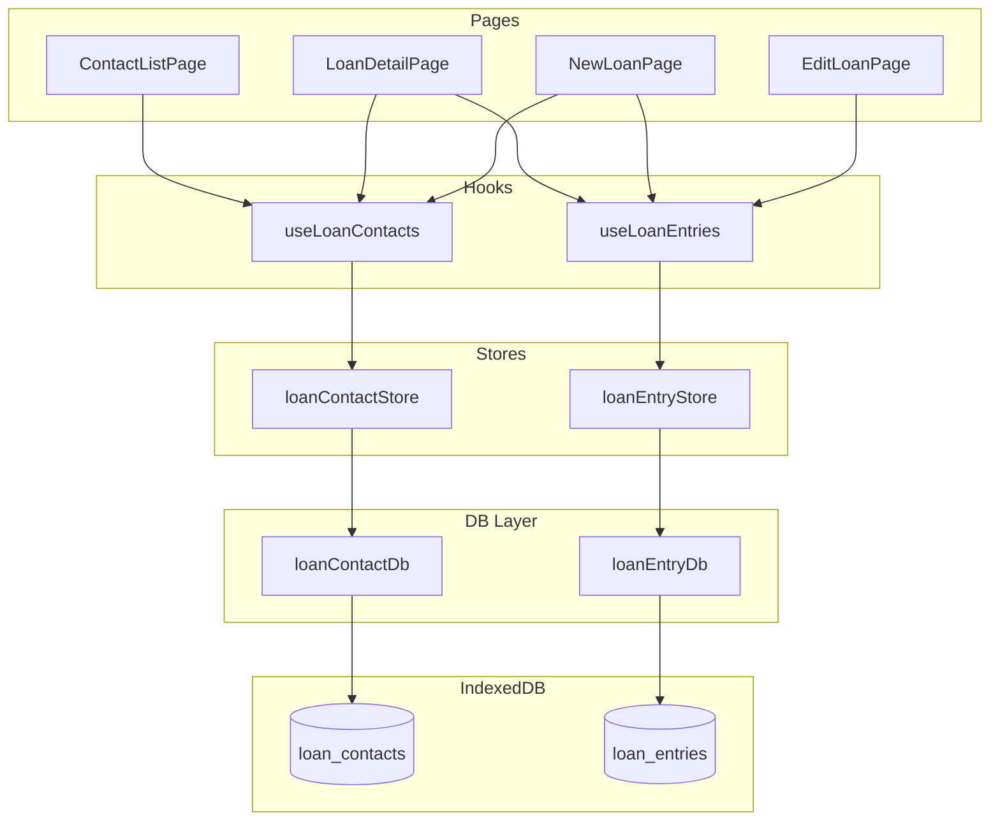

# Design Document: Loan Tracker

## Overview

Fitur **Loan Tracker** menambahkan modul pencatatan hutang-piutang ke aplikasi Flowang. Modul ini bersifat independen dari sistem transaksi utama — hutang tidak mempengaruhi saldo wallet secara langsung.

Arsitektur mengikuti pola yang sudah ada di codebase: dua object store baru di IndexedDB (`loan_contacts` dan `loan_entries`), dua pasang db/store/hook layer, dan halaman-halaman baru yang terhubung via React Router v6.

DB_VERSION di-increment dari `1` ke `2` untuk menambahkan dua object store baru.

---

## Architecture



### Prinsip Desain

- **Independen dari wallet**: Hutang tidak mengubah saldo wallet. Tidak ada join dengan `transactions` store.
- **Ikuti pola yang ada**: Setiap layer (db, store, hook) mengikuti konvensi `transactionDb.ts`, `transactionStore.ts`, `useTransactions.ts`.
- **Atomicity via IDBTransaction**: Operasi bulk (mark all settled, cascade delete) menggunakan satu `IDBTransaction` yang mencakup kedua store bila perlu.
- **Computed values di store**: Summary (totalLend, totalBorrow, netBalance) dihitung di store/hook layer, bukan di komponen.

---

## Components and Interfaces

### Component Tree

```
ContactListPage
├── LoanSummaryCard (header badge: jumlah contact dengan hutang aktif)
├── ContactList
│   └── ContactItem (per contact)
│       ├── nama contact
│       ├── total borrow aktif
│       ├── total lend aktif
│       └── badge "Lunas" jika semua settled
└── FAB → /loans/new (buat contact baru)

LoanDetailPage (/loans/:contactId)
├── LoanSummaryCard (ringkasan: totalLend, totalBorrow, netBalance)
├── Button "Tandai Semua Lunas" (disabled jika tidak ada active entry)
├── LoanEntryList
│   └── LoanEntryItem (per entry)
│       ├── jumlah, direction badge (lend/borrow)
│       ├── tanggal, note
│       ├── status badge (active/settled)
│       ├── Button "Mark Lunas" (toggle)
│       └── Button hapus (dengan konfirmasi)
├── Empty state: "Belum ada catatan hutang" + tombol tambah
└── FAB → /loans/:contactId/new

NewLoanPage (/loans/new atau /loans/:contactId/new)
└── LoanForm (mode: create)

EditLoanPage (/loans/:contactId/:entryId)
└── LoanForm (mode: edit)
```

### Komponen Detail

**`ContactItem`** — menampilkan satu baris contact di list:
- Props: `contact: LoanContact`, `summary: ContactSummary`, `onClick: () => void`, `onDelete: () => void`

**`ContactList`** — wrapper list:
- Props: `contacts: LoanContact[]`, `summaries: Map<string, ContactSummary>`

**`LoanEntryItem`** — satu baris entri hutang:
- Props: `entry: LoanEntry`, `onToggleSettled: (id: string) => void`, `onDelete: (id: string) => void`

**`LoanEntryList`** — wrapper list entri:
- Props: `entries: LoanEntry[]`

**`LoanForm`** — form create/edit:
- Props: `mode: 'create' | 'edit'`, `defaultContactId?: string`, `entry?: LoanEntry`, `onSubmit: (data: LoanEntryFormData) => void`
- Menggunakan `react-hook-form` + `zod` (sesuai pola yang ada)

**`LoanSummaryCard`** — kartu ringkasan:
- Props: `totalLend: number`, `totalBorrow: number` (netBalance dihitung di dalam)

---

## Data Models

### TypeScript Interfaces

```typescript
// src/types/index.ts — tambahkan di bawah definisi yang ada

export type LoanDirection = 'lend' | 'borrow';
export type LoanStatus = 'active' | 'settled';

export interface LoanContact {
  id: string;           // UUID v4
  name: string;         // wajib, maks 100 karakter
  note?: string;        // opsional
  createdAt: string;    // ISO 8601
  updatedAt: string;    // ISO 8601
}

export interface LoanEntry {
  id: string;           // UUID v4
  contactId: string;    // FK → LoanContact.id
  amount: number;       // > 0, maks 999_999_999_999
  direction: LoanDirection;
  status: LoanStatus;   // default: 'active'
  date: string;         // YYYY-MM-DD
  note?: string;        // opsional
  settledAt?: string;   // ISO 8601, diisi saat status → 'settled'
  createdAt: string;    // ISO 8601
  updatedAt: string;    // ISO 8601
}

// Computed type untuk summary per contact
export interface ContactSummary {
  contactId: string;
  totalLend: number;    // sum(amount) where direction='lend' AND status='active'
  totalBorrow: number;  // sum(amount) where direction='borrow' AND status='active'
  hasActiveEntries: boolean;
}

// Form data type (tanpa id, timestamps, status)
export interface LoanEntryFormData {
  contactId: string;
  amount: number;
  direction: LoanDirection;
  date: string;
  note?: string;
}
```

### IndexedDB Schema (DB_VERSION: 2)

```
Object Store: loan_contacts
  keyPath: 'id'
  Indexes: (tidak ada index tambahan — query by id saja)

Object Store: loan_entries
  keyPath: 'id'
  Indexes:
    - 'by_contactId' on 'contactId' (unique: false)
    - 'by_date' on 'date' (unique: false)
    - 'by_status' on 'status' (unique: false)
```

### Perubahan db.ts

```typescript
// DB_VERSION naik dari 1 ke 2
const DB_VERSION = 2;

// Tambahkan di dalam onupgradeneeded:
if (!db.objectStoreNames.contains('loan_contacts')) {
  db.createObjectStore('loan_contacts', { keyPath: 'id' });
}

if (!db.objectStoreNames.contains('loan_entries')) {
  const loanStore = db.createObjectStore('loan_entries', { keyPath: 'id' });
  loanStore.createIndex('by_contactId', 'contactId', { unique: false });
  loanStore.createIndex('by_date', 'date', { unique: false });
  loanStore.createIndex('by_status', 'status', { unique: false });
}
```

---

## Correctness Properties

*A property is a characteristic or behavior that should hold true across all valid executions of a system — essentially, a formal statement about what the system should do. Properties serve as the bridge between human-readable specifications and machine-verifiable correctness guarantees.*

### Property 1: Contact Storage Round-Trip

*For any* valid `LoanContact` object, menyimpannya ke IndexedDB lalu membacanya kembali dengan `getContactById` harus menghasilkan objek yang identik dengan input (semua field sama persis).

**Validates: Requirements 1.1, 6.1**

---

### Property 2: Contact Name Whitespace Validation

*For any* string yang seluruhnya terdiri dari whitespace characters (spasi, tab, newline), fungsi validasi nama contact harus menolaknya dan mengembalikan pesan error.

**Validates: Requirements 1.3**

---

### Property 3: Contact Name Length Validation

*For any* string dengan panjang lebih dari 100 karakter, fungsi validasi nama contact harus menolaknya dan mengembalikan pesan error.

**Validates: Requirements 1.4**

---

### Property 4: Loan Entry Storage Round-Trip

*For any* valid `LoanEntry` object, menyimpannya ke IndexedDB lalu membacanya kembali dengan `getEntryById` harus menghasilkan objek yang identik dengan input, dengan `status` bernilai `'active'`.

**Validates: Requirements 2.2, 6.1**

---

### Property 5: Amount Lower Bound Validation

*For any* angka yang kurang dari atau sama dengan nol, fungsi validasi amount harus menolaknya dan mengembalikan pesan error.

**Validates: Requirements 2.3**

---

### Property 6: Amount Upper Bound Validation

*For any* angka yang melebihi 999.999.999.999, fungsi validasi amount harus menolaknya dan mengembalikan pesan error.

**Validates: Requirements 2.4**

---

### Property 7: Loan Entry List Sorted by Date Descending

*For any* list of `LoanEntry` dengan tanggal yang bervariasi, setelah diurutkan oleh fungsi sort yang digunakan di `LoanDetail`, setiap elemen pada posisi `i` harus memiliki tanggal yang lebih baru atau sama dengan elemen pada posisi `i+1`.

**Validates: Requirements 2.6**

---

### Property 8: Mark Settled Toggle Round-Trip

*For any* `LoanEntry`, melakukan toggle status dua kali berturut-turut (active → settled → active) harus mengembalikan status ke nilai semula. Selain itu, setelah toggle pertama ke `settled`, field `settledAt` harus terisi dengan timestamp yang valid.

**Validates: Requirements 3.1, 3.6**

---

### Property 9: Mark All Settled Bulk Operation

*For any* list of `LoanEntry` milik satu contact (campuran `active` dan `settled`), setelah operasi `markAllSettled` selesai: semua entry yang sebelumnya `active` harus berstatus `settled`, semua entry yang sebelumnya sudah `settled` tetap `settled`, dan tidak ada entry yang berstatus `active` tersisa.

**Validates: Requirements 3.3, 3.4**

---

### Property 10: Contact Summary Calculation

*For any* list of `LoanEntry` milik satu contact, fungsi `computeContactSummary` harus menghasilkan `totalLend` yang sama persis dengan jumlah `amount` dari semua entry dengan `direction='lend'` dan `status='active'`, dan `totalBorrow` yang sama persis dengan jumlah `amount` dari semua entry dengan `direction='borrow'` dan `status='active'`.

**Validates: Requirements 1.5, 4.1**

---

### Property 11: Net Balance Label Correctness

*For any* pasangan nilai `totalLend` dan `totalBorrow` yang non-negatif, fungsi `getNetBalanceLabel` harus mengembalikan `"Kamu menagih"` jika `totalLend > totalBorrow`, `"Kamu berhutang"` jika `totalBorrow > totalLend`, dan `"Lunas semua"` jika keduanya sama.

**Validates: Requirements 4.2**

---

### Property 12: Active Contacts Badge Count

*For any* list of contacts beserta entries mereka, fungsi `countContactsWithActiveLoans` harus mengembalikan jumlah yang sama persis dengan jumlah contact yang memiliki minimal satu entry dengan `status='active'`.

**Validates: Requirements 4.4**

---

### Property 13: Delete Entry Removes Permanently

*For any* `LoanEntry` yang sudah tersimpan di IndexedDB, setelah `deleteEntry(id)` dipanggil, `getEntryById(id)` harus mengembalikan `undefined`.

**Validates: Requirements 5.1**

---

### Property 14: Delete Contact Cascades to Entries

*For any* `LoanContact` yang memiliki satu atau lebih `LoanEntry`, setelah `deleteContact(contactId)` dipanggil secara atomik, `getEntriesByContactId(contactId)` harus mengembalikan array kosong.

**Validates: Requirements 5.2**

---

## Error Handling

### Strategi Error per Layer

**DB Layer (`loanContactDb.ts`, `loanEntryDb.ts`)**
- Semua fungsi melempar `Error` jika `IDBRequest` atau `IDBTransaction` gagal
- Tidak ada silent failure — error selalu di-propagate ke atas
- Operasi atomik (markAllSettled, deleteContact + entries) menggunakan satu `IDBTransaction` dengan `onerror` dan `onabort` yang me-reject Promise

**Store Layer (`loanContactStore.ts`, `loanEntryStore.ts`)**
- Setiap action membungkus operasi dalam `try/catch`
- Jika error: `set({ error: message, isLoading: false })` — state data tidak berubah
- Jika sukses: update state secara optimistik setelah operasi DB berhasil

**UI Layer (Pages & Components)**
- Membaca `error` dari store dan menampilkan toast/alert via `sonner` (sesuai pola yang ada)
- Form validation error ditampilkan inline via `react-hook-form` + `zod`
- Dialog konfirmasi sebelum delete (menggunakan `AlertDialog` dari shadcn/ui)

### Error Cases Spesifik

| Skenario | Handling |
|---|---|
| Contact name kosong/whitespace | Zod validation, error inline di form |
| Contact name > 100 karakter | Zod validation, error inline di form |
| Amount ≤ 0 | Zod validation, error inline di form |
| Amount > 999_999_999_999 | Zod validation, error inline di form |
| IndexedDB tidak tersedia | Error di `openDB`, ditangkap di `uiStore` (pola yang sudah ada) |
| Operasi IDB gagal | Error di-propagate ke store, ditampilkan via toast |
| Contact tidak ditemukan saat edit | Redirect ke `/loans` dengan toast error |

---

## Testing Strategy

### Dual Testing Approach

Fitur ini menggunakan dua lapisan pengujian yang saling melengkapi:

1. **Property-based tests** — memverifikasi properti universal yang harus berlaku untuk semua input valid
2. **Unit/example tests** — memverifikasi skenario spesifik, edge case, dan UI behavior

### Property-Based Testing

Library: **fast-check** (sudah ada di devDependencies, digunakan di test yang ada)
Runner: **bun:test** (sesuai pola yang ada)
Minimum iterasi: **100 runs** per property test

Setiap property test harus diberi tag komentar:
```typescript
// Feature: loan-tracker, Property N: <deskripsi singkat property>
```

**File test yang akan dibuat:**

```
src/__tests__/
├── db/
│   ├── loanContactDb.test.ts   — Property 1, 13, 14 (round-trip, delete)
│   └── loanEntryDb.test.ts     — Property 4, 8, 9, 13 (round-trip, toggle, bulk)
├── helpers/
│   └── arbitraries.ts          — tambahkan arbitraryLoanContact, arbitraryLoanEntry
└── utils/
    └── loanUtils.test.ts       — Property 2, 3, 5, 6, 7, 10, 11, 12 (pure functions)
```

**Arbitraries yang perlu ditambahkan ke `arbitraries.ts`:**

```typescript
export const arbitraryLoanDirection = fc.constantFrom<LoanDirection>('lend', 'borrow');
export const arbitraryLoanStatus = fc.constantFrom<LoanStatus>('active', 'settled');

export const arbitraryLoanContact = fc.record({
  id: fc.uuid(),
  name: fc.string({ minLength: 1, maxLength: 100 }),
  note: fc.option(fc.string(), { nil: undefined }),
  createdAt: safeDateStr(),
  updatedAt: safeDateStr(),
});

export const arbitraryLoanEntry = fc.record({
  id: fc.uuid(),
  contactId: fc.uuid(),
  amount: fc.double({ min: 0.01, max: 999_999_999_999, noNaN: true }),
  direction: arbitraryLoanDirection,
  status: arbitraryLoanStatus,
  date: fc.tuple(
    fc.integer({ min: 2020, max: 2030 }),
    fc.integer({ min: 1, max: 12 }),
    fc.integer({ min: 1, max: 28 })
  ).map(([y, m, d]) => `${y}-${String(m).padStart(2, '0')}-${String(d).padStart(2, '0')}`),
  note: fc.option(fc.string(), { nil: undefined }),
  settledAt: fc.option(safeDateStr(), { nil: undefined }),
  createdAt: safeDateStr(),
  updatedAt: safeDateStr(),
});
```

### Unit/Example Tests

**Skenario yang dicover dengan example tests:**
- Empty state di `LoanDetailPage` (tidak ada entries)
- Dialog konfirmasi muncul sebelum delete
- Loading state saat `markAllSettled` sedang berjalan
- Pre-fill contact name di `LoanForm` saat buka dari `LoanDetailPage`
- Navigasi dari `ContactListPage` ke `LoanDetailPage`

### Struktur File Implementasi

```
src/
├── db/
│   ├── db.ts                    — DB_VERSION: 2, tambah loan_contacts & loan_entries stores
│   ├── loanContactDb.ts         — CRUD untuk loan_contacts
│   └── loanEntryDb.ts           — CRUD + markAllSettled + deleteWithContact untuk loan_entries
├── stores/
│   ├── loanContactStore.ts      — Zustand store: contacts, isLoading, error + actions
│   └── loanEntryStore.ts        — Zustand store: entries, isLoading, error + actions
├── hooks/
│   ├── useLoanContacts.ts       — thin wrapper hook
│   └── useLoanEntries.ts        — thin wrapper hook + computed (summary, netBalance)
├── lib/
│   └── loanUtils.ts             — pure functions: computeContactSummary, getNetBalanceLabel,
│                                  countContactsWithActiveLoans, sortEntriesByDate,
│                                  validateContactName, validateAmount
├── pages/
│   └── loans/
│       ├── ContactListPage.tsx
│       ├── LoanDetailPage.tsx
│       ├── NewLoanPage.tsx
│       └── EditLoanPage.tsx
├── components/
│   └── loans/
│       ├── ContactItem.tsx
│       ├── ContactList.tsx
│       ├── LoanEntryItem.tsx
│       ├── LoanEntryList.tsx
│       ├── LoanForm.tsx
│       └── LoanSummaryCard.tsx
├── types/
│   └── index.ts                 — tambahkan LoanContact, LoanEntry, ContactSummary, LoanEntryFormData
└── routes/
    └── index.tsx                — tambahkan routes /loans/*
```

### Routes Baru

```typescript
// Tambahkan ke src/routes/index.tsx
{ path: 'loans', element: <ContactListPage /> },
{ path: 'loans/new', element: <NewLoanPage /> },
{ path: 'loans/:contactId', element: <LoanDetailPage /> },
{ path: 'loans/:contactId/new', element: <NewLoanPage /> },
{ path: 'loans/:contactId/:entryId', element: <EditLoanPage /> },
```

### Keputusan Desain

| Keputusan | Pilihan | Alasan |
|---|---|---|
| Computed summary | Di hook layer (`useLoanEntries`) | Konsisten dengan pola yang ada; komponen tetap "dumb" |
| Pure utility functions | Di `src/lib/loanUtils.ts` | Memudahkan property-based testing tanpa mock |
| Zod schema | Di `LoanForm.tsx` atau file terpisah | Konsisten dengan pola `react-hook-form` + `zod` yang sudah ada |
| Cascade delete | Satu `IDBTransaction` untuk contact + entries | Atomicity sesuai Requirement 5.2 |
| Toggle settled | Satu fungsi `toggleEntryStatus` di db layer | Lebih sederhana dari dua fungsi terpisah |
