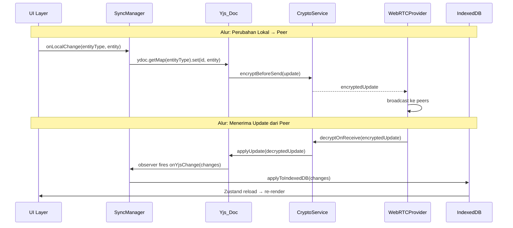

# Design Document: Sinkronisasi Data Multi-Device

## Overview

Fitur Sinkronisasi Data Multi-Device menambahkan kemampuan sinkronisasi real-time P2P dan cloud backup ke aplikasi Flowang. Arsitektur yang dipilih adalah **hybrid zero-server-database**: sinkronisasi langsung antar perangkat via WebRTC + Yjs CRDT saat perangkat aktif bersamaan, dan Google Drive App Data sebagai fallback persistence saat perangkat lain offline. Seluruh data dienkripsi end-to-end menggunakan AES-256-GCM dengan kunci yang di-generate lokal — tidak ada data plaintext yang pernah meninggalkan perangkat pengguna.

Pendekatan ini dipilih karena:
- **Zero server cost** untuk data storage — tidak perlu backend database
- **Privacy by design** — operator server tidak dapat membaca data pengguna
- **Offline-first** — aplikasi tetap berfungsi penuh tanpa koneksi internet
- **Conflict-free** — CRDT Yjs menyelesaikan konflik merge secara otomatis

Fitur ini diakses melalui halaman Settings baru (`/settings`) yang ditambahkan sebagai item keenam di Bottom Navigation.

---

## Architecture

### Layer Diagram

```
┌─────────────────────────────────────────────────────────────────┐
│                         UI LAYER                                │
│  SettingsPage  ─  SyncKeyCard  ─  QRScanner  ─  GoogleDriveCard│
│  BottomNav (+ SyncIndicator dot)  ─  OfflineBanner             │
└────────────────────────────┬────────────────────────────────────┘
                             │ useSync hook
┌────────────────────────────▼────────────────────────────────────┐
│                       SYNC LAYER                                │
│  SyncManager ──────────────────────────────────────────────────│
│    ├── WebRTCProvider (y-webrtc + reconnect logic)              │
│    └── GoogleDriveProvider (OAuth + Drive API)                  │
│  syncStore (Zustand) — syncStatus, syncKey, googleAuth          │
└──────────┬──────────────────────────────────────┬──────────────┘
           │                                      │
┌──────────▼──────────┐              ┌────────────▼──────────────┐
│    CRYPTO LAYER     │              │       CRDT LAYER           │
│  CryptoService      │              │  Yjs_Doc                   │
│  AES-256-GCM        │              │  ydoc.getMap('wallets')    │
│  Web Crypto API     │              │  ydoc.getMap('transactions')│
│  IV: 12 bytes       │              │  ydoc.getMap('categories') │
│  Auth tag: 16 bytes │              │  y-indexeddb persistence   │
└──────────┬──────────┘              └────────────┬──────────────┘
           │                                      │
┌──────────▼──────────────────────────────────────▼──────────────┐
│                      STORAGE LAYER                              │
│  IndexedDB (native)                                             │
│    stores: wallets, transactions, categories                    │
│  Zustand stores: walletStore, transactionStore, categoryStore   │
└─────────────────────────────────────────────────────────────────┘
```

### Alur Data Utama



---

## Components and Interfaces

### Struktur Direktori Baru

```
src/
├── pages/settings/
│   └── SettingsPage.tsx          # Halaman utama /settings
├── components/settings/
│   ├── SyncKeyCard.tsx           # QR Code + Sync Key display
│   ├── QRScanner.tsx             # Kamera scanner (modal/overlay)
│   ├── SyncStatusIndicator.tsx   # Status dot + label
│   ├── GoogleDriveCard.tsx       # Google Drive backup UI
│   └── OfflineBanner.tsx         # Non-blocking offline banner
├── sync/
│   ├── syncManager.ts            # Koordinator utama
│   ├── webrtcProvider.ts         # y-webrtc wrapper + reconnect logic
│   ├── googleDriveProvider.ts    # Google OAuth + Drive API
│   ├── cryptoService.ts          # AES-256-GCM encrypt/decrypt
│   └── syncStore.ts              # Zustand store untuk sync state
├── hooks/
│   └── useSync.ts                # Hook untuk komponen
└── lib/
    └── envConfig.ts              # Validasi env vars
```

### Hierarki Komponen SettingsPage

```
SettingsPage
├── OfflineBanner (conditional — hanya jika syncKey ada & disconnected)
├── SyncStatusIndicator (dot 8×8px + label teks)
├── SyncKeyCard
│   ├── QRCodeDisplay (200×200px, library: qrcode.react)
│   ├── SyncKeyText (masked dengan • / visible toggle)
│   ├── CopyButton ("Salin" → "Tersalin!" selama 2 detik)
│   ├── ResetButton (dengan ConfirmDialog sebelum eksekusi)
│   └── ScanButton → QRScanner (modal overlay)
│       ├── CameraPreview (video element, latensi ≤100ms)
│       ├── ManualInputField (alternatif input teks)
│       └── CancelButton
└── GoogleDriveCard
    ├── LoginButton / UserInfo (nama + email) + LogoutButton
    ├── BackupTimestamp (ISO 8601 → format lokal)
    └── RestoreDialog (conditional — muncul saat IDB kosong)
```

### Update BottomNav

Item keenam ditambahkan ke array `navItems`:

```typescript
{ to: "/settings", icon: Settings, label: "Pengaturan" }
```

`SyncIndicator` dot 6×6px ditambahkan di sudut kanan atas ikon Settings:
- **Merah solid** — `disconnected`
- **Kuning + animasi pulse 1Hz** — `connecting`
- **Hijau solid** — `connected`
- Dot hanya dirender jika `syncKey !== null` (user sudah setup sync)

---

## Data Models

### SyncKeyPayload

```typescript
// Format Sync Key
interface SyncKeyPayload {
  roomName: string;       // UUID v4 — identifikasi Sync_Room
  encryptionKey: string;  // base64url-encoded 256-bit AES key
  version: number;        // format version, saat ini 1
}

// Sync_Key = base64url(JSON.stringify(SyncKeyPayload))
// Panjang string: 32–512 karakter
// Validasi: harus dapat di-decode menjadi SyncKeyPayload dengan semua field wajib
```

### SyncState (Zustand Store)

```typescript
type SyncStatus = 'disconnected' | 'connecting' | 'connected';

interface GoogleUserInfo {
  name: string;
  email: string;
}

interface SyncState {
  // State
  syncStatus: SyncStatus;
  syncKey: string | null;              // base64url string, null jika belum setup
  googleAuthToken: string | null;
  googleUserInfo: GoogleUserInfo | null;
  lastBackupTimestamp: string | null;  // ISO 8601
  syncError: string | null;

  // Actions
  setSyncStatus: (status: SyncStatus) => void;
  setSyncKey: (key: string | null) => void;
  setGoogleAuth: (token: string | null, userInfo: GoogleUserInfo | null) => void;
  setLastBackupTimestamp: (ts: string) => void;
  setSyncError: (error: string | null) => void;
  loadFromStorage: () => Promise<void>;
}
```

### Yjs Document Structure

```typescript
// Yjs_Doc memetakan tiga entity store utama Flowang
const ydoc = new Y.Doc();

ydoc.getMap('wallets')      // Y.Map<string, Wallet>      — key: wallet.id
ydoc.getMap('transactions') // Y.Map<string, Transaction> — key: transaction.id
ydoc.getMap('categories')   // Y.Map<string, Category>    — key: category.id

// Persistence: y-indexeddb menyimpan Yjs_Doc ke IndexedDB store 'yjs-sync'
// sehingga state CRDT bertahan setelah browser ditutup
```

### EnvConfig

```typescript
// src/lib/envConfig.ts
const REQUIRED_VARS = [
  'VITE_WEBRTC_SIGNALING_URL',
  'VITE_GOOGLE_CLIENT_ID',
  'VITE_GOOGLE_API_KEY',
] as const;

const OPTIONAL_VARS = [
  'VITE_STUN_URL',
  'VITE_TURN_URL',
  'VITE_TURN_USERNAME',
  'VITE_TURN_CREDENTIAL',
] as const;

export interface EnvConfig {
  signalingUrl: string;
  googleClientId: string;
  googleApiKey: string;
  stunUrl?: string;
  turnUrl?: string;
  turnUsername?: string;
  turnCredential?: string;
}

export class EnvConfigError extends Error {
  constructor(public missingVars: string[]) {
    super(`Missing required environment variables: ${missingVars.join(', ')}`);
  }
}

export function validateEnvConfig(): void  // throws EnvConfigError jika ada yang missing
export function getIceServers(): RTCIceServer[]  // build dari env vars
export const envConfig: EnvConfig  // singleton, diinisialisasi setelah validateEnvConfig()
```

---

## Sync Manager — Alur Data Kritis

### Inisialisasi Sync

```
App mount
  → envConfig.validate()
      IF missing vars → render EnvConfigErrorPage (fullscreen, blocking)
  → syncStore.loadFromStorage()
      → baca syncKey dari IndexedDB store 'sync-config'
      → baca googleAuthToken dari IndexedDB store 'sync-config'
  → IF syncKey exists
      → decode SyncKeyPayload dari syncKey
      → webrtcProvider.connect(roomName, encryptionKey)
  → IF googleAuthToken exists
      → googleDriveProvider.checkRestore()
          → IF IndexedDB kosong (0 records di wallets+transactions+categories)
              → tampilkan RestoreDialog
```

### Perubahan Data Lokal → Sync ke Peer

```
walletStore / transactionStore / categoryStore action berhasil
  → syncManager.onLocalChange(entityType, entity)
  → ydoc.getMap(entityType).set(entity.id, entity)
  → y-webrtc otomatis broadcast Yjs update ke semua peers
      → sebelum kirim: cryptoService.encrypt(yjsUpdate, encryptionKey)
          IF enkripsi gagal → batalkan pengiriman, setSyncError(msg)
  → googleDriveProvider.scheduleBackup()
      → debounce 30 detik
      → serialize semua data IndexedDB → JSON bytes
      → cryptoService.encrypt(jsonBytes, encryptionKey)
      → upload ke App_Data_Folder sebagai 'flowang-backup.enc'
      → retry 3x dengan interval 5 detik jika gagal
      → IF berhasil → setLastBackupTimestamp(now)
```

### Menerima Update dari Peer

```
y-webrtc menerima encrypted Yjs update
  → cryptoService.decrypt(encryptedUpdate, encryptionKey)
      IF decryptionKey tidak ada → tolak, setSyncError(msg)
      IF GCM auth tag invalid → buang data, setSyncError(msg)
  → Y.applyUpdate(ydoc, decryptedUpdate)
  → ydoc observer fires → syncManager.onYjsChange(entityType, changes)
  → syncManager.applyToIndexedDB(changes)
      → upsert/delete records di IndexedDB
  → Zustand store reload (loadWallets / loadTransactions / loadCategories)
  → UI re-render (< 500ms)
```

### Reconnect dengan Exponential Backoff

```
webrtcProvider.onDisconnect()
  → syncStore.setSyncStatus('connecting')
  → attempt = 0, delay = 1000ms

  WHILE attempt < 10:
    await sleep(delay)
    try:
      await connect(signalingUrl, roomName)
      setSyncStatus('connected')
      BREAK
    catch:
      delay = Math.min(delay * 2, 30_000)
      attempt++

  IF attempt >= 10:
    setSyncStatus('disconnected')
    // user dapat menekan tombol "Hubungkan" untuk retry manual
```

### Google Drive Restore

```
googleDriveProvider.checkRestore()
  → list files di App_Data_Folder
  → IF 'flowang-backup.enc' ada:
      → tampilkan RestoreDialog kepada pengguna
      → IF pengguna konfirmasi:
          → download 'flowang-backup.enc'
          → cryptoService.decrypt(encryptedBytes, encryptionKey)
              IF gagal → tampilkan error "Sync Key tidak cocok"
          → parse JSON → import ke IndexedDB
          → reload semua Zustand stores
          → UI re-render
      → IF pengguna tolak:
          → tutup dialog, lanjutkan normal
```

---

## CryptoService

```typescript
// src/sync/cryptoService.ts
// Menggunakan Web Crypto API (native browser) — tidak perlu library eksternal

/**
 * Generate kunci AES-256-GCM baru secara lokal.
 * Menggunakan crypto.subtle.generateKey dengan extractable=true
 * agar dapat diekspor ke base64url untuk disimpan di Sync_Key.
 */
async function generateEncryptionKey(): Promise<CryptoKey>

/**
 * Ekspor CryptoKey ke string base64url untuk disimpan di SyncKeyPayload.
 * Menggunakan format 'raw' (256-bit = 32 bytes).
 */
async function exportKeyToBase64(key: CryptoKey): Promise<string>

/**
 * Import kunci dari string base64url (dari SyncKeyPayload.encryptionKey).
 * Menggunakan format 'raw', algorithm AES-GCM, extractable=false.
 */
async function importKeyFromBase64(base64: string): Promise<CryptoKey>

/**
 * Enkripsi data menggunakan AES-256-GCM.
 * Output format: [12-byte IV][encrypted data][16-byte GCM auth tag]
 * IV di-generate secara acak untuk setiap operasi enkripsi.
 */
async function encrypt(data: Uint8Array, key: CryptoKey): Promise<Uint8Array>

/**
 * Dekripsi data yang dienkripsi dengan encrypt().
 * Memverifikasi GCM auth tag secara otomatis.
 * Melempar DOMException('OperationError') jika auth tag tidak valid
 * atau data telah dimodifikasi.
 */
async function decrypt(data: Uint8Array, key: CryptoKey): Promise<Uint8Array>
```

**Keputusan desain:**
- IV (Initialization Vector) 12 bytes adalah ukuran yang direkomendasikan NIST untuk AES-GCM
- GCM auth tag 16 bytes memberikan 128-bit authentication security
- IV baru untuk setiap enkripsi mencegah nonce reuse attack
- Web Crypto API digunakan langsung (bukan library) untuk menghindari dependensi tambahan dan memanfaatkan implementasi native yang sudah diaudit keamanannya

---

## Correctness Properties

*A property is a characteristic or behavior that should hold true across all valid executions of a system — essentially, a formal statement about what the system should do. Properties serve as the bridge between human-readable specifications and machine-verifiable correctness guarantees.*

### Property 1: Sync Key Round-Trip

*For any* valid `SyncKeyPayload` (dengan `roomName` berupa UUID v4 yang valid, `encryptionKey` berupa base64url 256-bit yang valid, dan `version` berupa integer positif), mengenkode payload ke base64url kemudian mendekode kembali harus menghasilkan objek yang identik — `roomName`, `encryptionKey`, dan `version` tidak berubah.

**Validates: Requirements 2.1, 2.2, 3.5**

---

### Property 2: Encrypt-Decrypt Round-Trip

*For any* `Uint8Array` plaintext dengan panjang 0 hingga 1 MB, mengenkripsi dengan `cryptoService.encrypt(plaintext, key)` kemudian mendekripsi hasilnya dengan `cryptoService.decrypt(ciphertext, key)` menggunakan kunci yang sama harus menghasilkan `Uint8Array` yang byte-for-byte identik dengan plaintext asal.

**Validates: Requirements 6.5, 6.6, 8.1, 8.3, 8.4, 7.10**

---

### Property 3: AES-GCM Authentication Tag Rejection

*For any* ciphertext yang dihasilkan oleh `cryptoService.encrypt()`, memodifikasi satu byte manapun pada posisi acak (termasuk area IV, data terenkripsi, maupun auth tag) harus menyebabkan `cryptoService.decrypt()` melempar error dan tidak pernah mengembalikan plaintext — bahkan sebagian.

**Validates: Requirements 8.6**

---

### Property 4: CRDT Confluence

*For any* dua set perubahan data (tambah/edit/hapus pada wallets, transactions, atau categories) yang dilakukan secara independen pada dua `Y.Doc` terpisah yang dimulai dari state yang sama, melakukan merge keduanya dalam urutan A→B maupun B→A harus menghasilkan state akhir `Y.Doc` yang byte-for-byte identik — terlepas dari urutan merge.

**Validates: Requirements 6.8**

---

### Property 5: Exponential Backoff Bounds

*For any* sequence reconnect attempts dari attempt ke-0 hingga ke-9, delay sebelum attempt ke-n harus tepat `Math.min(1000 * Math.pow(2, n), 30000)` milidetik. Setelah attempt ke-9 gagal (total 10 kali gagal berturut-turut), `syncStatus` harus berubah menjadi `'disconnected'` dan tidak ada attempt ke-10 yang dilakukan.

**Validates: Requirements 9.4**

---

### Property 6: Sync Key Validation

*For any* string input, `validateSyncKey(input)` harus mengembalikan `true` jika dan hanya jika string tersebut adalah base64url yang valid, panjangnya antara 32–512 karakter, dan dapat di-decode menjadi `SyncKeyPayload` dengan `roomName` (string non-empty), `encryptionKey` (string non-empty), dan `version` (integer positif) yang semuanya terdefinisi. Untuk semua input lain — termasuk string kosong, string dengan karakter non-base64url, string terlalu pendek/panjang, atau JSON yang tidak memiliki field wajib — fungsi harus mengembalikan `false`.

**Validates: Requirements 3.5, 3.11**

---

## Error Handling

### Kategori Error dan Penanganannya

| Kategori | Kondisi | Penanganan |
|---|---|---|
| **EnvConfigError** | Env var wajib tidak terdefinisi saat app mount | Render halaman error fullscreen blocking, tampilkan daftar var yang hilang |
| **CryptoError** | Enkripsi gagal sebelum kirim | Batalkan pengiriman, `setSyncError(msg)`, jangan kirim plaintext |
| **DecryptionError** | Auth tag GCM invalid | Buang data, `setSyncError(msg)`, pertahankan Yjs_Doc tanpa modifikasi |
| **MissingKeyError** | Encryption_Key tidak ada saat dekripsi | Tolak data, `setSyncError(msg)` |
| **WebRTCError** | Koneksi gagal | Exponential backoff (10x), lalu `setSyncStatus('disconnected')` |
| **TURNFallbackError** | P2P gagal, TURN tidak bisa dihubungi | `setSyncStatus('disconnected')`, tampilkan pesan error di Settings_Page |
| **GoogleAuthError** | OAuth gagal atau token expired | Hapus token dari storage, tampilkan tombol "Login dengan Google" kembali |
| **BackupUploadError** | Upload ke Drive gagal | Retry 3x dengan interval 5 detik, tampilkan peringatan jika semua gagal |
| **RestoreDecryptError** | Dekripsi backup gagal (key tidak cocok) | Tampilkan error "Sync Key tidak cocok dengan backup" |
| **RestoreDownloadError** | Download dari Drive gagal | Tampilkan error, sarankan coba lagi |
| **InvalidQRCodeError** | QR Code tidak mengandung Sync_Key valid | Tampilkan "QR Code tidak valid", lanjutkan pemindaian |
| **InvalidSyncKeyError** | Input manual Sync_Key tidak valid | Tampilkan "Format Sync Key tidak valid" di bawah field input |
| **CameraPermissionError** | Pengguna menolak izin kamera | Tampilkan pesan, tampilkan field input manual sebagai alternatif |

### Prinsip Error Handling

1. **Non-blocking untuk operasi sync** — error sinkronisasi tidak boleh memblokir penggunaan fitur utama (catat transaksi, lihat laporan, dll.)
2. **Fail-safe untuk enkripsi** — jika enkripsi gagal, data tidak dikirim dalam bentuk plaintext
3. **Preserve local state** — jika dekripsi data dari peer gagal, Yjs_Doc lokal tidak dimodifikasi
4. **User-visible errors** — semua error yang memerlukan tindakan pengguna ditampilkan di Settings_Page via `syncError` state
5. **Retry dengan batas** — operasi yang bisa di-retry (upload, reconnect) memiliki batas maksimal untuk menghindari infinite loop

---

## Testing Strategy

### Pendekatan Dual Testing

Fitur ini menggunakan dua pendekatan testing yang saling melengkapi:
- **Unit tests** — verifikasi contoh spesifik, edge cases, dan kondisi error
- **Property-based tests** — verifikasi properti universal di seluruh ruang input menggunakan `fast-check`

### Library dan Tools

- **Test runner**: Bun test (`bun test`)
- **PBT library**: `fast-check` v4 (sudah ada di devDependencies)
- **Mock**: Bun built-in mocking untuk Web Crypto API, y-webrtc, Google Drive API
- **Minimum iterasi PBT**: 100 per property test

### Unit Tests

**`src/__tests__/sync/cryptoService.test.ts`**
- Verifikasi `generateEncryptionKey()` menghasilkan key dengan algoritma AES-GCM 256-bit
- Verifikasi `exportKeyToBase64()` menghasilkan string base64url yang valid
- Verifikasi `importKeyFromBase64()` berhasil untuk key yang valid
- Verifikasi `importKeyFromBase64()` melempar error untuk string yang bukan base64url valid
- Edge case: enkripsi data kosong (0 bytes)
- Edge case: enkripsi data 1 byte

**`src/__tests__/sync/syncKeyUtils.test.ts`**
- Verifikasi `generateSyncKey()` menghasilkan SyncKeyPayload dengan semua field wajib
- Verifikasi `validateSyncKey()` mengembalikan `false` untuk string kosong
- Verifikasi `validateSyncKey()` mengembalikan `false` untuk string < 32 karakter
- Verifikasi `validateSyncKey()` mengembalikan `false` untuk string > 512 karakter
- Verifikasi `validateSyncKey()` mengembalikan `false` untuk JSON valid tapi tanpa field `roomName`

**`src/__tests__/sync/envConfig.test.ts`**
- Verifikasi `validateEnvConfig()` melempar `EnvConfigError` jika `VITE_WEBRTC_SIGNALING_URL` tidak ada
- Verifikasi `validateEnvConfig()` melempar `EnvConfigError` jika `VITE_GOOGLE_CLIENT_ID` tidak ada
- Verifikasi `validateEnvConfig()` berhasil jika semua required vars ada
- Verifikasi `getIceServers()` mengembalikan array kosong jika semua STUN/TURN vars tidak ada
- Verifikasi TURN vars: jika hanya sebagian terdefinisi, dianggap konfigurasi tidak valid

**`src/__tests__/sync/backoffLogic.test.ts`**
- Verifikasi delay attempt ke-0 = 1000ms
- Verifikasi delay attempt ke-1 = 2000ms
- Verifikasi delay attempt ke-5 = 30000ms (sudah mencapai cap)
- Verifikasi status menjadi `disconnected` setelah attempt ke-9 gagal

### Property-Based Tests

**`src/__tests__/sync/cryptoService.pbt.test.ts`**

```typescript
// Feature: multi-device-sync, Property 2: Encrypt-Decrypt Round-Trip
test.prop([fc.uint8Array({ minLength: 0, maxLength: 1_048_576 })])(
  'encrypt then decrypt returns original plaintext',
  async (plaintext) => {
    const key = await generateEncryptionKey();
    const ciphertext = await encrypt(plaintext, key);
    const decrypted = await decrypt(ciphertext, key);
    expect(decrypted).toEqual(plaintext);
  },
  { numRuns: 100 }
);

// Feature: multi-device-sync, Property 3: AES-GCM Authentication Tag Rejection
test.prop([
  fc.uint8Array({ minLength: 1, maxLength: 10_000 }),
  fc.nat(),
])(
  'any byte modification causes decrypt to throw',
  async (plaintext, byteIndexSeed) => {
    const key = await generateEncryptionKey();
    const ciphertext = await encrypt(plaintext, key);
    const tampered = new Uint8Array(ciphertext);
    const byteIndex = byteIndexSeed % tampered.length;
    tampered[byteIndex] ^= 0xff;
    await expect(decrypt(tampered, key)).rejects.toThrow();
  },
  { numRuns: 100 }
);
```

**`src/__tests__/sync/syncKeyUtils.pbt.test.ts`**

```typescript
// Feature: multi-device-sync, Property 1: Sync Key Round-Trip
test.prop([fc.uuid(), fc.integer({ min: 1, max: 10 })])(
  'encode then decode SyncKeyPayload returns identical payload',
  async (roomName, version) => {
    const key = await generateEncryptionKey();
    const encryptionKey = await exportKeyToBase64(key);
    const payload: SyncKeyPayload = { roomName, encryptionKey, version };
    const encoded = encodeSyncKey(payload);
    const decoded = decodeSyncKey(encoded);
    expect(decoded).toEqual(payload);
  },
  { numRuns: 100 }
);

// Feature: multi-device-sync, Property 6: Sync Key Validation
test.prop([fc.string()])(
  'validateSyncKey returns false for arbitrary strings',
  (input) => {
    // Arbitrary strings should almost always be invalid
    // (valid ones are extremely rare in random generation)
    const result = validateSyncKey(input);
    if (result) {
      // If it returns true, verify it's actually a valid payload
      const decoded = decodeSyncKey(input);
      expect(decoded).toHaveProperty('roomName');
      expect(decoded).toHaveProperty('encryptionKey');
      expect(decoded).toHaveProperty('version');
    }
  },
  { numRuns: 200 }
);
```

**`src/__tests__/sync/crdtConfluence.pbt.test.ts`**

```typescript
// Feature: multi-device-sync, Property 4: CRDT Confluence
test.prop([
  fc.array(arbitraryWallet, { minLength: 1, maxLength: 10 }),
  fc.array(arbitraryWallet, { minLength: 1, maxLength: 10 }),
])(
  'merging two Yjs docs in any order produces identical state',
  (changesA, changesB) => {
    const docA = new Y.Doc();
    const docB = new Y.Doc();

    // Apply changes independently
    changesA.forEach(w => docA.getMap('wallets').set(w.id, w));
    changesB.forEach(w => docB.getMap('wallets').set(w.id, w));

    // Merge A→B
    const docMergeAB = new Y.Doc();
    Y.applyUpdate(docMergeAB, Y.encodeStateAsUpdate(docA));
    Y.applyUpdate(docMergeAB, Y.encodeStateAsUpdate(docB));

    // Merge B→A
    const docMergeBA = new Y.Doc();
    Y.applyUpdate(docMergeBA, Y.encodeStateAsUpdate(docB));
    Y.applyUpdate(docMergeBA, Y.encodeStateAsUpdate(docA));

    expect(Y.encodeStateAsUpdate(docMergeAB))
      .toEqual(Y.encodeStateAsUpdate(docMergeBA));
  },
  { numRuns: 100 }
);
```

**`src/__tests__/sync/backoffLogic.pbt.test.ts`**

```typescript
// Feature: multi-device-sync, Property 5: Exponential Backoff Bounds
test.prop([fc.integer({ min: 0, max: 9 })])(
  'backoff delay for attempt n equals min(1000 * 2^n, 30000)',
  (n) => {
    const delay = calculateBackoffDelay(n);
    const expected = Math.min(1000 * Math.pow(2, n), 30_000);
    expect(delay).toBe(expected);
  },
  { numRuns: 100 }
);
```

### Integration Tests

**`src/__tests__/integration/yjsIndexedDB.test.ts`**
- Verifikasi perubahan di Yjs_Doc ter-persist ke IndexedDB via y-indexeddb
- Verifikasi reload Yjs_Doc dari IndexedDB menghasilkan state yang sama
- Mock: fake-indexeddb (sudah ada di devDependencies)

**`src/__tests__/integration/syncManager.test.ts`**
- Verifikasi alur: local change → Yjs update → encrypted broadcast (mock WebRTC)
- Verifikasi alur: receive encrypted update → decrypt → apply to IndexedDB → Zustand reload
- Verifikasi full sync setelah reconnect (mock disconnect/reconnect)
- Mock: y-webrtc, Web Crypto API

**`src/__tests__/integration/googleDriveProvider.test.ts`**
- Verifikasi backup: serialize → encrypt → upload (mock Drive API)
- Verifikasi restore: download → decrypt → import ke IndexedDB
- Verifikasi retry logic: 3x dengan interval 5 detik
- Mock: Google Drive API, fetch

---

## Appendix: File .env.example

```dotenv
# =============================================================================
# Flowang — Environment Variables
# Salin file ini ke .env dan isi dengan nilai yang sesuai.
# JANGAN commit file .env ke version control.
# =============================================================================

# -----------------------------------------------------------------------------
# WebRTC Signaling Server (WAJIB)
# URL server signaling y-webrtc untuk negosiasi koneksi P2P awal.
# Server ini TIDAK menyimpan data pengguna — hanya memfasilitasi handshake.
# Contoh server open-source: https://github.com/yjs/y-webrtc#signaling
# -----------------------------------------------------------------------------
VITE_WEBRTC_SIGNALING_URL=wss://your-signaling-server.example.com

# -----------------------------------------------------------------------------
# Google OAuth & Drive API (WAJIB)
# Diperlukan untuk fitur Google Drive backup/restore.
# Buat credentials di: https://console.cloud.google.com/apis/credentials
# Aktifkan Google Drive API dan tambahkan scope: drive.appdata
# -----------------------------------------------------------------------------
VITE_GOOGLE_CLIENT_ID=your-google-client-id.apps.googleusercontent.com
VITE_GOOGLE_API_KEY=your-google-api-key

# -----------------------------------------------------------------------------
# STUN Server (OPSIONAL)
# Membantu perangkat menemukan alamat IP publik untuk koneksi P2P.
# Jika tidak diisi, WebRTC akan mencoba koneksi tanpa STUN (mungkin gagal di NAT).
# Contoh server STUN publik (tidak direkomendasikan untuk produksi):
# stun:stun.l.google.com:19302
# -----------------------------------------------------------------------------
VITE_STUN_URL=stun:your-stun-server.example.com:3478

# -----------------------------------------------------------------------------
# TURN Server (OPSIONAL, tapi direkomendasikan untuk produksi)
# Relay server untuk koneksi WebRTC saat P2P langsung tidak memungkinkan
# (misalnya di balik NAT ketat atau firewall korporat).
# SEMUA tiga variabel TURN harus diisi atau tidak sama sekali.
# Jika hanya sebagian diisi, konfigurasi TURN dianggap tidak valid.
# -----------------------------------------------------------------------------
VITE_TURN_URL=turn:your-turn-server.example.com:3478
VITE_TURN_USERNAME=your-turn-username
VITE_TURN_CREDENTIAL=your-turn-credential
```
