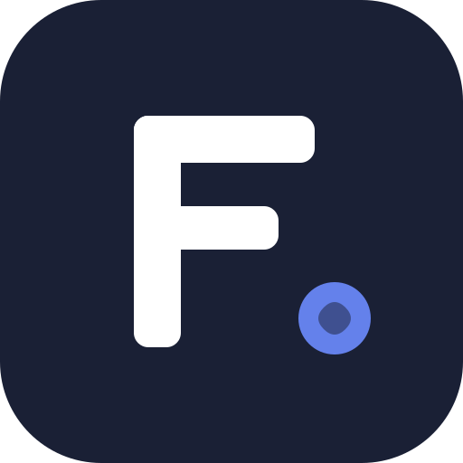

<div align="center">
  

  <h1>Flowang</h1>
  <p>A lightweight, private personal finance tracker that works fully offline.</p>

  **[flowang.irsyadulibad.my.id](https://flowang.irsyadulibad.my.id)**

  
  
  
  
</div>

---

## Features

- **Offline-first** — all data stored in IndexedDB, no internet required
- **Privacy-first** — no accounts, no servers, no tracking
- **Multi-wallet** — manage multiple wallets and bank accounts
- **Full transaction types** — income, expense, and wallet-to-wallet transfers
- **Financial reports** — realtime, monthly, and custom date range summaries
- **Loans & debts** — track borrowing and lending with settlement status
- **E2E sync** — optional peer-to-peer sync via WebRTC + AES-256-GCM encryption
- **Google Drive backup** — optional, encrypted before upload
- **PWA** — installable on mobile like a native app

## Stack

| | |
|---|---|
| Runtime | [Bun](https://bun.sh) |
| Framework | React 19 + React Router v7 |
| Styling | Tailwind CSS v4 + shadcn/ui |
| State | Zustand |
| Storage | IndexedDB (browser-native) |
| Sync | Yjs CRDT + y-webrtc |

## Getting Started

Install dependencies:

```bash
bun install
```

Copy environment variables:

```bash
cp .env.example .env
```

Start the development server:

```bash
bun dev
```

Build for production:

```bash
bun run build
```

Run the production server:

```bash
bun start
```

Run tests:

```bash
bun test
```

## Project Structure

```
flowang/
├── public/          # Static assets (icons, manifest, sw, screenshots)
├── src/             # Source code
│   ├── components/  # UI components
│   ├── db/          # IndexedDB layer
│   ├── hooks/       # React hooks
│   ├── pages/       # Page components
│   ├── stores/      # Zustand stores
│   ├── sync/        # Sync engine (WebRTC, Google Drive, Yjs)
│   └── types/       # TypeScript types
├── styles/          # Global CSS
└── tests/           # Test suites
```
